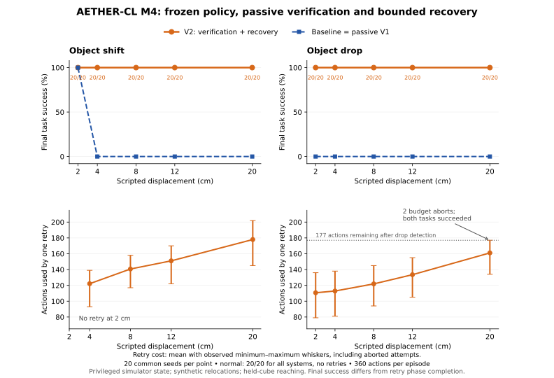

# AETHER-CL M4 Frozen Magnitude Robustness Sweep

Date: 2026-10-05 (Asia/Shanghai)

Status: native sweep complete and independently audited. All 660 selected
trials and all strict comparisons pass; all 98 local tests passed before
execution. This extends Prototype A evaluation without policy or recovery tuning.

## Question and accepted basis

How does the fixed nominal policy, passive verification and bounded recovery
perform as the scripted disturbance magnitude increases? Where, within the
tested range, do recovery completion and costs deteriorate?

The [accepted M3 isolation replication](AETHER_CL_M3_Isolated_Screening.md#corrected-native-results)
verified all 180 trial checks and strict pairs on the original selected seeds.
Normal success was 19/19 per system, shifted/drop baseline/V1 0/19, and V2
19/19 for both. These same-seed correction results motivate a new protocol,
not additional tuning on the accepted sample. Original failures are retained.

## Frozen matrix

New preselected native seeds: **60–79**, used for every point/system. There is
no adaptive seed selection or replacement. Unit fixtures do not observe these
native simulator resets. All systems retain the accepted M3 configuration.

| Point family | Magnitudes | Injection | Systems | Selected trials |
| --- | --- | --- | --- | --- |
| Normal | No injection | None | Baseline / V1 / V2 | 60 |
| Object shift | 2, 4, 8, 12, 20 cm | World-Y relocation before step 81 | Baseline / V1 / V2 | 300 |
| Object drop | 2, 4, 8, 12, 20 cm | Initial cube height plus World-Y relocation before step 181 | Baseline / V1 / V2 | 300 |

Total: **660 selected one-episode native children**, 33 system/point cells,
220 baseline/V1 full pairs, 220 V1/V2 causal pairs and 200 normal-baseline
versus disturbed-baseline pre-injection controls. Each eligible episode has
360 actions, so 237,600 actions is the maximum before exclusions/errors.
There are 20 distinct seeds, not 660 independent initial scenes. The same
seeds across magnitudes provide matched comparisons; dense frames and these
repeated conditions are correlated.

The existing runtime permits 0.02–0.20 m magnitudes. M4 stays within that
range and leaves its validation unchanged. The 12 cm point is an anchor on new
seeds. If no recovery failure occurs up to 20 cm, report that limited result;
do not extrapolate a failure threshold or claim unrestricted robustness.

Normal is a separate no-injection control. Its native config retains the
unused 0.12 m field because the frozen config rejects zero. The report gives
its actual magnitude as null. It must not be plotted as a zero-displacement
drop: dropping also changes height, even without a horizontal shift.

The [machine protocol](evidence/AETHER_CL_M4_Robustness_Protocol.json) freezes
the matrix, order, scoring, settings, ten accepted execution/helper hashes and
the new runner's hash. Both earlier protocols and hashes are checked too.
All are verified before output/launch and before each new trial. Controller,
verifier, physics, task tolerance, budgets, timestamps and injection direction
stay unchanged. M4 uses the existing `aether_cl.m3` child CLI. Manifest purpose
and schema remain M3 execution; the parent records M4 evaluation scope.

## Isolation and fair comparisons

Order: normal, ascending shift magnitudes, ascending drop magnitudes; inside
each point, seed 60–79 and baseline/V1/V2. Every child is a fresh interpreter
and fresh simulator with exactly one reset. GPU 1 stays process-local cuda:0;
CPU physics and state observations remain unchanged. There is no rendering
or wall-clock viewer pacing in the measurement batch.

Full reset observations remain strict, including grasp flags. Baseline/V1
full action/state/reference traces must match exactly. V1/V2 reset, verifier
and action/state prefixes must match through the first recovery trigger, or
for the whole run if no intervention occurs. Preintervention injections must
also match. Each disturbed baseline must match the same-seed normal baseline
reset and trace through step 80 for shift or 180 for drop. This additional
control verifies that magnitude comparisons start from identical trajectories.

The unchanged episode checker replays shared task/reference/verifier metrics,
injection geometry/order, first diagnosis/latency, recovery trigger/gates,
budgets, terminal holding, snapshots and TCP path cost. Native manifests must
also match the parent suite's complete recorded software/startup contract.
A passing suite means comparable complete evidence, not successful recovery.

## Outcomes and curve

`suite.json` records every selected trial and paired/control check. `curve.csv`
contains 33 cell rows with magnitude, system, completeness/comparison validity,
eligible denominators, task success, attempts, conditional recovery success,
action/path costs and final distance. `validated_curve_success_rate` is null
unless the point's triplets and controls are complete and valid. Individual
task rates are descriptive evidence; they do not override failed comparisons.

Cell JSON additionally records aborted attempts/declines, first failure
categories/latencies and aggregated confusion counts, detection precision/
recall, diagnosis agreement and uncertainty/coverage. Counts aggregate raw
reference agreement, not independent perception accuracy. Failed attempts
contribute to costs. Zero attempts produce null conditional metrics. Errors
and incomplete cells produce null rates; no unavailable outcomes are invented.

Matched V1/V2 counts distinguish both failed, recovery-only success,
passive-only success and both succeeded. Invalid/incomplete pairs have a null
paired effect. Normal failures and recovery regressions remain outcomes;
they are not filtered or used to pick new seeds. Reset ineligibility is logged
with zero actions and remains present in every relevant denominator table.

The archived raw dataset supports the audited robustness plot below.
Do not treat correlated per-step detection counts as hundreds of thousands
of independent trials. The frozen rates are reported only after raw evidence
and all paired controls have passed the independent audit.

## Long runs and continuation

Use a fixed new study directory, an archive outside it and the isolated
`aether-cl` environment. The runner uses an OS-held study lock to prevent two
writers. First launch refuses an existing study/archive. Launch it through
`nohup` so SSH disconnection does not stop the experiment. The final archive
includes all raw logs, recorded file hashes, protocol, report and CSV.

`--stop-after N` pauses gracefully after N new trials and produces a uniquely
named partial archive. `--resume` with the same output/final archive verifies
protocol, source, recorded software, normalized startup environment, original
trial order/configs and every prior raw hash; completed checks replay again.
It continues only unstarted slots. It never reruns failed/interrupted slots,
changes a seed or overwrites an earlier raw file/archive. A child interrupted
midtrial stays invalid, so continuation cannot turn it into accepted evidence.
An unfinished checkpoint after abrupt process termination fails closed.

Only ephemeral SSH/terminal/shell keys listed in the protocol are removed
from the child environment. Every child in a session receives the same
captured normalized environment. Its complete digest is stored, rather than
the contents of possibly sensitive environment variables; continuation must
match that digest. The native library, CUDA, package and source settings
remain checked. Older partial archives retain their original indices/hashes;
only the generated working archive index is refreshed for the next snapshot.

Keep this repository revision unchanged until the batch finishes. Changing
Git revision, libraries or environment during continuation is rejected.
The completed native run used the existing A100 environment; no extra
packages or 4090 were required.

### First launch on the server

After transferring the published bundle and updating to the exact supplied
revision, the operator commands first run three selected native trials with
`--stop-after 3`, check their integrity, then start the same study in the
background with `--resume`. Those first three remain part of the 660 selected
trials; they are not extra samples or tuning data. The direct background
first-launch command is:

```bash
cd /home/jiangle/aura-work/AURA-Embodied-offline/aura-sim/prototype_aether_cl
source /home/jiangle/miniconda3/etc/profile.d/conda.sh
conda activate aether-cl
unset LD_PRELOAD
export LD_LIBRARY_PATH=/home/jiangle/aura-work/aether-glvnd-1.4.0/usr/lib/x86_64-linux-gnu
export CUDA_VISIBLE_DEVICES=1
nohup /home/jiangle/miniconda3/envs/aether-cl/bin/python -u -m aether_cl.m4_robustness \
    --output /home/jiangle/aura-work/AURA-Embodied-offline/aura-sim/prototype_aether_cl/runs/m4-robustness-seeds60-79 \
    --archive /home/jiangle/aura-work/aether-cl-m4-robustness-seeds60-79.tar.gz \
    > /home/jiangle/aura-work/aether-cl-m4-robustness-seeds60-79.log 2>&1 < /dev/null &
```

Watch progress with `tail -f` on that full log path. Ctrl+C in the log viewer
stops only that viewer. This batch does not open a browser. Live viewing is
launched separately with the existing preview/Enter gate after selecting a
useful case from the audited curve.

### Continue a gracefully paused study on the server

Run only after the original process has exited and no final archive exists:

```bash
cd /home/jiangle/aura-work/AURA-Embodied-offline/aura-sim/prototype_aether_cl
source /home/jiangle/miniconda3/etc/profile.d/conda.sh
conda activate aether-cl
unset LD_PRELOAD
export LD_LIBRARY_PATH=/home/jiangle/aura-work/aether-glvnd-1.4.0/usr/lib/x86_64-linux-gnu
export CUDA_VISIBLE_DEVICES=1
nohup /home/jiangle/miniconda3/envs/aether-cl/bin/python -u -m aether_cl.m4_robustness \
    --resume \
    --output /home/jiangle/aura-work/AURA-Embodied-offline/aura-sim/prototype_aether_cl/runs/m4-robustness-seeds60-79 \
    --archive /home/jiangle/aura-work/aether-cl-m4-robustness-seeds60-79.tar.gz \
    >> /home/jiangle/aura-work/aether-cl-m4-robustness-seeds60-79.log 2>&1 < /dev/null &
```

## Local validation

All 98 tests pass (143.703 seconds), including the six M4 tests. The complete
660-slot wiring fixture verifies exact magnitudes/order/configuration, one
episode per fresh child call, identical normalized startup environments,
pause/continue without rerunning slots, all 33 cells/640 comparisons, excluded
seeds and failed-retry costs, CSV rows and every final/partial archive hash.
Earlier partial archives remain byte-identical and their index is not
duplicated during continuation. Error/interruption slots stay invalid on
continuation; partial rates/effects remain null.

Separate tests reject changed protocol/source/environment, raw tampering and
competing writers. Thirteen actual runtime fixture episodes cover both small
and large shift/drop magnitudes, three systems, strict episode replay and
normal-control prefixes; a deliberate pre-injection observation change is
rejected. Aggregated diagnosis counts are independently checked against
VerificationMetrics with misdiagnoses, uncertainty and incomplete rates.
Python 3.10 grammar, CLI help, exact protocol/source guards and documentation
links verify. Fixtures do not validate native contacts or produce M4 findings.

## Audited native results

Archive: `aether-cl-m4-robustness-seeds60-79.tar.gz` (85,938,578 bytes).
SHA-256: `a183e1357d6aba771fa193ae358dbcd1af30d11325eb3898ec4e93cf2a0f0bbd`.
Native clean source: `67a44d13b5363b615b5214ff543c34224e6af745`.
The [machine audit](evidence/AETHER_CL_M4_Native_Audit.json) preserves exact
cell metrics, 660 compact episode rows, software/protocol provenance and
controller-terminal versus task outcome details. Original raw logs remain in
the archive; this report does not replace or modify them.

All **3,304 indexed file hashes**, **660 trial checks**, **237,600 actions**,
**220 passive full pairs**, **220 recovery causal pairs** and **200 normal
pre-injection controls** pass. All 660 episodes are eligible; none excluded.
Independent action/phase, reference, verifier and recovery replay agrees.
Maximum action replay error is 2.9802322387695312e-8, within the existing
3e-7 replay tolerance; strict native pairing tolerances were not relaxed.
The aggregate report and CSV reproduce exactly. Ordered binary64 accumulation
reproduces native Python 3.10 means when auditing under Python 3.12.



Every entry uses the same 20 preselected seeds. Baseline and passive V1 have
identical physical traces and final task outcomes. Passive verification alone
adds detection, with no action intervention and no task-success improvement.

| Displacement | Shift baseline / V1 | Shift V2 | Drop baseline / V1 | Drop V2 |
| --- | --- | --- | --- | --- |
| 2 cm | 20/20 | 20/20 | 0/20 | 20/20 |
| 4 cm | 0/20 | 20/20 | 0/20 | 20/20 |
| 8 cm | 0/20 | 20/20 | 0/20 | 20/20 |
| 12 cm | 0/20 | 20/20 | 0/20 | 20/20 |
| 20 cm | 0/20 | 20/20 | 0/20 | 20/20 |

Normal control is 20/20 in each system, with no retries. The 2 cm shift also
needs no retry. Across 220 matched V1/V2 pairs, V2 rescues **180** V1 failures,
40 succeed in both systems, and none regress or fail in both. This is a finite
observed sample, not an estimate of unrestricted reliability. No final-task
recovery failure threshold was found within the tested 2–20 cm range.

| Displacement | Shift mean retry actions | Shift mean TCP path | Drop mean retry actions | Drop mean TCP path |
| --- | --- | --- | --- | --- |
| 2 cm | No attempt | No attempt | 110.65 | 0.43727 m |
| 4 cm | 122.10 | 0.50310 m | 112.85 | 0.44746 m |
| 8 cm | 140.70 | 0.59029 m | 121.85 | 0.48974 m |
| 12 cm | 151.00 | 0.63968 m | 133.50 | 0.54483 m |
| 20 cm | 177.95 | 0.76777 m | 161.05 | 0.67574 m |

Means include every attempted retry, including aborts. Controller actions are
not wall-clock thinking time; the batch was unrendered and unpaced. Observed
TCP travel is a path-length cost, not energy or joint effort. Costs increase
with disturbance size. Across recovery-needed cells, median final goal errors
range from **1.11 to 1.34 cm**, versus **0.459 mm** for the normal control.
These results establish the frozen 2.5 cm task tolerance, not fine precision.

### Task success and retry completion differ

Of 180 attempted retries, **178 complete their recovery phases** and **two
abort at the remaining action budget**. All 180 finish with shared task success.
Both aborts occur at 20 cm drop; neither achieves success after the deadline.

| Drop seed | First shared task success | First recovery hold action | Budget abort | Final goal error |
| --- | --- | --- | --- | --- |
| 69 | Step 352 | Step 353 | Step 360 | 1.487 cm |
| 76 | Step 353 | Step 354 | Step 360 | 1.353 cm |

The drop is applied before step 181; detection triggers at 183, leaving
177 actions (184–360). Shared scoring requires five consecutive static
observations, whereas retry phase completion additionally requires ten hold
actions. These episodes already satisfy the task before their longer hold
phase exhausts the budget. Their terminal state is `aborted` with
`remaining_action_budget_exhausted`; final contact grasp and task success
remain true. The protocol defines conditional recovery success by final
shared task outcome after an attempt, not by `attempt_complete`. Reporting
both prevents 20/20 final success from implying 20/20 completed retries at
this point. Do not retune the budget, hold duration or task scoring in this data.

### Verification evidence

First failure detection retains two-step latency for all 180 V2 retry cases:
`GRASP_FAILURE` for shifts of 4–20 cm, `OBJECT_LOST` for all drops. Normal and
2 cm shifts have no first detected failures or retries. Exact per-cell dense
confusion counts, recall and later diagnosis agreement are in the machine
audit. First diagnosis correctness does not imply perfect later step-by-step
agreement. This remains privileged-state agreement against a simulator
reference sharing geometry, not independent camera-based failure detection.

### Paused live inspection

The batch above is the measured evidence. A rendered replay is an illustration,
not a replacement measurement: rendering can change native execution details.
Inspect the 20 cm drop at seed 69 to see the observed budget edge. The commands
work with the already deployed frozen source; no new bundle or packages are
needed for this view.

On the **laptop, in PowerShell**, open the tunnel and log in:

```powershell
Set-Location "C:\Workspace\AURA-Deploy"
ssh -p 2221 -L 8765:127.0.0.1:8765 -o ExitOnForwardFailure=yes jiangle@166.111.59.11
```

In the resulting **server Bash terminal**:

```bash
(
cd /home/jiangle/aura-work/AURA-Embodied-offline/aura-sim/prototype_aether_cl || exit
source /home/jiangle/miniconda3/etc/profile.d/conda.sh
conda activate aether-cl || exit
unset LD_PRELOAD
export LD_LIBRARY_PATH=/home/jiangle/aura-work/aether-glvnd-1.4.0/usr/lib/x86_64-linux-gnu
export CUDA_VISIBLE_DEVICES=1
python -m aether_cl.m3 \
    --system v2 \
    --live \
    --disturbance object_drop \
    --disturbance-magnitude 0.20 \
    --seed 69 \
    --episodes 1 \
    --max-steps 360 \
    --fps 10 \
    --render-device cuda:0 \
    --output /home/jiangle/aura-work/AURA-Embodied-offline/aura-sim/prototype_aether_cl/runs/m4-edge-live \
    --port 8765
)
```

Wait for `OPEN http://127.0.0.1:8765 NOW` and the Enter prompt. Open
**http://127.0.0.1:8765 on the laptop and confirm the initial frame is visible**.
Only then press Enter in the server terminal. The arm remains paused until
that Enter. The final frame remains available until Ctrl+C stops the viewer.
Port 8000 is not used. If the tunnel reports port 8765 already in use, retain
the existing working tunnel or stop only its old AETHER session before retrying.

## Scope and next decisions

This is a finite synthetic magnitude curve on one held-cube target-reaching
task with privileged observations. It is not force-disturbance validation,
camera perception, release/support placement, insertion, embodiment transfer
or full AETHER. M4 now supplies audited magnitude/cost evidence for return
to 02. The immediate engineering follow-up is to characterize the hold/budget
edge and preregister a motion/precision variant with a fresh matched baseline;
changing nominal motions would require rerunning that comparison. More
realistic force disturbances, release/support tasks and camera perception
remain separate subsequent protocols. Prototype A remains in progress.
