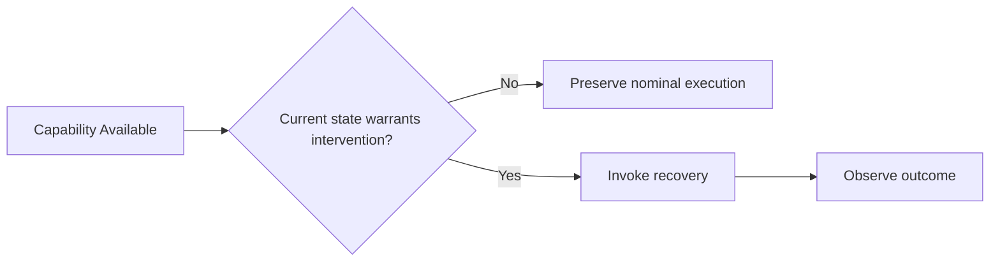

# AETHER-CL M5 — 02 Research Review and M6 Scope Decision

Date: 2026-10-06 (Asia/Shanghai)

Status: **02 accepts M5 Verification-Gating Attribution within its frozen scope. M5 satisfies its causal-attribution objective. Prototype A remains scientifically open.**

Authority: audited M5 evidence published at `68cca22f4070af197add1c3cb568d9bff6831934`, including
`AETHER_CL_M5_Attribution.md`, the independent machine audit and the M5
return-to-02 handoff.

## 1. M5 acceptance

02 accepts the audited M5 result:

- 960 eligible isolated episodes on fresh seeds 80–99;
- 345,600 actions and 1,160 strict comparisons;
- no exclusions, replacements or comparison-tolerance waivers;
- exact aligned V2/V3 physical traces in all 180 disturbed cases where the
  same recovery capability was invoked at the same time;
- V2 avoided all 60 unnecessary V3 recovery attempts on baseline-success
  controls;
- healthy drop-family V3 regressed from nominal success to 0/20 because the
  scheduled retry unnecessarily opened a valid grasp and the unchanged retry
  could not re-establish it;
- V2 and V3 achieved the same 177/180 final successes in the 180 disturbed
  recovery-needed cases.

M5 therefore resolves the causal question posed by DEC-0003 for this held-cube
task: the demonstrated value of explicit verification is **selective invocation
of recovery**, not improved execution of an already aligned identical recovery
routine.

## 2. Hypothesis updates

### H3 — Verification-centered autonomy

Previous formulation:

> Reliable autonomy requires knowing whether intended physical effects occurred.

**Updated formulation:**

> Verification can improve autonomy by deciding whether corrective intervention
> is warranted, thereby preserving healthy execution and avoiding unnecessary or
> harmful recovery. Its value is conditional on task structure, recovery policy
> and available alternative gating mechanisms.

**Status: bounded support.**

M5 directly supports verification as a selective intervention gate in this
privileged-state held-cube setting. It does **not** establish that explicit
verification is universally necessary for successful recovery, because a
phase-aware verifier-free schedule that triggers the same recovery at the same
time produces identical disturbed-task physics and outcomes.

### H4 — Recovery as intelligence

Previous formulation:

> Recovery capability may be more meaningful than first-attempt success.

**Updated formulation:**

> Recovery can raise final autonomy beyond first-attempt policy success, but
> recovery is not intrinsically beneficial. Intelligent recovery requires both
> an effective corrective capability and appropriate invocation.

**Status: supported within current scope.**

M4/M5 show that bounded recovery rescues many otherwise failed disturbed trials,
while M5 shows that unnecessary recovery can add large cost, degrade precision
or destroy an already successful state.

### H7 — Adaptive intelligence allocation

Previous formulation:

> Agents should decide when to act, observe, predict, retrieve memory, or replan.

**Updated status: first bounded empirical support for selective capability
invocation.**

M5 is not a general reasoning-allocation experiment, but V2's state-dependent
decision to invoke recovery only when needed materially outperforms an
always-scheduled invocation strategy on healthy controls. This supports the
broader AETHER idea that capability availability and capability orchestration
are distinct research questions.

## 3. Architectural lesson

M5 sharpens AETHER's organization principle:

More capability is not automatically more intelligence. A physical agent must
decide **when** a capability should intervene. This is now an evidence-backed
design consideration rather than only a conceptual idea.

## 4. Prototype A remains open

M5 does not close Prototype A. The remaining closure dimensions are:

1. support placement and release;
2. contact-rich insertion;
3. at least one physics-propagated disturbance;
4. at least one non-privileged sensor-based verifier.

Motion/precision limitations observed in M4/M5 remain important, but old-task
motion optimization is not selected as the next standalone experiment. New
tasks may require new task-specific motions and matched baselines.

## 5. Next engineering round — M6 Support Placement and Release

02 selects **support placement/release** as the next closure dimension.

### Research question

> Does the AETHER-CL verification/recovery loop remain useful when task success
> requires a completed physical state transition from *held object* to *released,
> stably supported object in the target region*?

This is a more meaningful manipulation endpoint than held-cube target reaching
and directly tests the distinction between action/transport completion and
physical task completion.

### Scope

Use the existing Panda/cube simulation family unless engineering finds a
technical reason to propose another minimal equivalent. Add a designated support
surface/target region and extend the nominal controller only as required to:

1. grasp;
2. lift/transport;
3. descend to placement;
4. release;
5. retract clear of the object;
6. observe post-release stability.

Reuse existing grasp/lift/transport primitives where applicable. Do not use M6
as an opportunity to optimize the old nominal motion path.

### Systems

Run a new task-specific matched three-system matrix:

- **Baseline:** new fixed placement/release nominal controller only;
- **V1:** identical physical controller + passive verification;
- **V2:** identical nominal controller + verification-gated one bounded recovery
  opportunity.

**Do not carry V3 into the main M6 matrix.** V3 was a causal attribution control
for M5, not a proposed architecture. Reintroduce it only if a new attribution
question appears.

### Success semantics

M6 success must require all of the following:

- the cube is no longer held by the gripper;
- the cube is supported by the designated support surface;
- the cube is inside the frozen target tolerance/region;
- the cube remains stable for a frozen consecutive-observation window;
- the end-effector has retracted sufficiently to avoid counting gripper support
  as object support.

To isolate the semantic change from precision redesign, keep the existing
2.5 cm horizontal goal tolerance for the first M6 protocol unless a simulator
geometry constraint makes it invalid. Any tighter tolerance requires an
explicit preregistered rationale and applies identically to all systems.

### Placement-specific disturbance

M6 must include at least one disturbance that creates a **post-release or
placement-phase failure**, not only the earlier grasp/transport relocations.

Preferred controlled family:

> after nominal release but before the final stability window completes,
> synthetically translate the cube laterally by a preregistered magnitude while
> preserving a valid simulator state.

This is intentionally still a synthetic causal intervention; it does **not**
satisfy the later physics-propagated-disturbance closure requirement.

The purpose is to produce a clean placement failure in which V1 can detect an
off-target/unstable released object and V2 can, if its one recovery opportunity
remains available, re-observe, regrasp, replace, release and reverify.

A healthy no-disturbance control and at least one within-tolerance/easy control
must remain in the matrix so unnecessary recovery/regression is measurable.

### Recovery contract

Keep Prototype A bounded:

- at most one recovery episode per trial;
- recovery may re-observe/regrasp/re-place/re-release as required by the new
  task;
- if an earlier failure consumes the one recovery opportunity and placement
  later fails, retain that outcome rather than silently granting a second retry;
- this limitation is scientifically useful because it may reveal the need for
  hierarchical or multi-stage recovery in a future hypothesis.

### Failure categories

Extend the taxonomy only as necessary, for example:

- grasp failure;
- object lost;
- placement target not reached;
- release not achieved;
- unsupported placement;
- post-release instability;
- final state mismatch;
- uncertain state.

Do not create categories that cannot be scored or audited consistently.

### Baseline and budget

M6 is a new task and therefore requires a **new frozen matched baseline**.
The action budget may change because release, retraction and potential
regrasp/replacement add real work. Freeze the task-specific budget before fresh
native evaluation and apply it identically across systems. Do not preserve 360
actions merely for historical symmetry if it makes the new task structurally
invalid.

Development fixtures may be used to establish a viable task protocol, but the
native evaluation matrix, seeds, disturbance magnitudes, budget, success
criteria and source hashes must be frozen before any fresh native outcome is
observed.

### Required evaluation

Report at minimum:

- final placement success;
- release success;
- support/stability success;
- passive detection/diagnosis;
- recovery attempt and recovery success;
- unnecessary recovery/regression on controls;
- action count and TCP path cost;
- final placement error;
- controller completion versus task success;
- matched baseline/V1/V2 comparisons;
- complete raw/audit provenance.

Use fresh preselected seeds with no adaptive replacement.

### Audit requirements

Retain the evidence discipline established in M3–M5:

- fresh isolated episode processes;
- source/protocol/hash guards;
- baseline/V1 full physical trace equality;
- V1/V2 equality through the first causal intervention;
- exact disturbance provenance;
- no tolerance relaxation after native observation;
- preserve rejected/failed attempts rather than replacing them.

## 6. Deferred Prototype A dimensions

M6 does **not** authorize:

- contact-rich insertion;
- physics-propagated disturbance claims;
- RGB/RGB-D/non-privileged verification;
- memory or experience learning;
- world models;
- Prototype B/C/D;
- foundation-model integration;
- general motion redesign.

Likely order after M6, subject to evidence:

1. M6 — support placement/release;
2. M7 — contact-rich insertion;
3. M8 — physics-propagated disturbance replication;
4. M9 — non-privileged sensor verification;
5. final 02 Prototype A scientific review.

## 7. 02W decision

**Do not activate 02W for M6.**

The task-semantic extension is bounded and can be implemented/tested directly
in 06-01. A likely 02W trigger remains M9, where choosing among visual
state-estimation, learned success detection, multimodal/VLM verification and
hybrid approaches may require deeper research before implementation.

## 8. Engineering routing

Return to **06-01 — AETHER-CL** for **M6 Support Placement and Release only**.

After M6 implementation, frozen native execution and independent audit, return
to 02 before insertion or any other next scope. PR #1 remains draft/unmerged
unless separately reviewed and accepted.

Prototype A is still the active prototype. No Prototype B/C/D decision has
been made.
