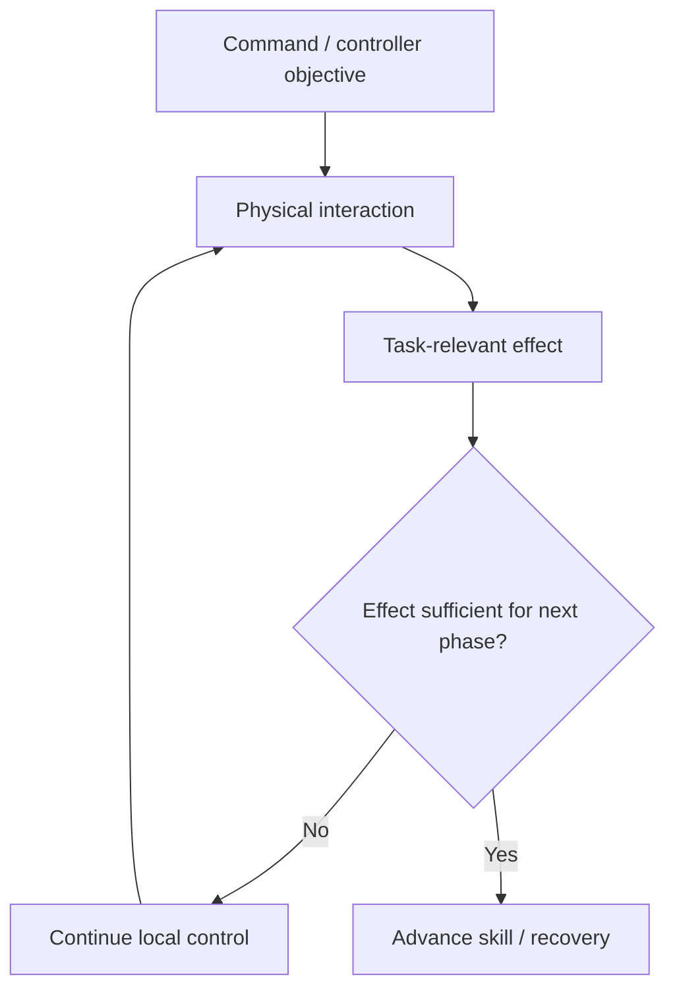

# AETHER-CL M6R — 02 Research Review and M7 Scope Decision

Date: 2026-10-06 (Asia/Shanghai)

Status: **02 accepts M6R within its preregistered scope. The fresh-seed evidence
supports the narrow effect-aligned phase-completion claim for released placement.
Prototype A remains scientifically open.**

Authority: audited M6R evidence published at `79d2f9000126f4f0ce33446753ad598ddfd044a4`, including
`AETHER_CL_M6R_Results.md`, its independent machine audit and the M6R
return-to-02 handoff.

## 1. M6R acceptance

02 accepts the audited M6R result:

- 480 selected records, 456 eligible records and 364,800 actions;
- all 480 child replays and all 460 strict comparisons pass;
- seed 132 remains a retained zero-action exclusion in all cells;
- Baseline/V1/V2-old retain the frozen M6 outcomes;
- V2R changes only the authorized recovery lower-phase readiness predicate;
- V2-old and V2R remain exact through the common physical/controller/verifier
  history up to the first justified lower-readiness difference;
- all 70 failed-placement cases are attempted by both recovery systems;
- V2-old times out in lower and rescues 0/70;
- V2R reaches release, retracts and completes stable supported placement in
  70/70;
- no unnecessary attempt or final-success regression occurs on the 44
  Baseline-success condition/seed pairs.

The 70 rescues reuse 19 common eligible seed scenes across conditions and must
not be represented as 70 independent scene-level discoveries.

## 2. Causal interpretation

M6R provides unusually clean evidence for the local phase-contract change.

At the common lower-state boundary:

- retained minimum-motion, general TCP-distance, orientation and attachment
  gates already pass;
- cube support geometry is satisfied;
- cube horizontal target error is already inside the frozen task tolerance;
- only the old dedicated 3 mm TCP-Z requirement prevents phase transition.

V2R replaces that end-effector-specific lower criterion with the authorized
task-relevant placement-ready condition. Physical actions first diverge one
step after the readiness decision, and the repaired system subsequently
releases, retracts and independently satisfies the original task score.

Therefore the supported claim is:

> **For this contact-constrained placement task, a recovery phase-completion
> condition aligned with the physical effect required by the next phase enables
> successful recovery where a stricter end-effector-space completion gate does
> not.**

This does not establish that object/task-state gates should universally replace
servo-space conditions. It establishes that the two levels must be aligned and
that controller-space completion alone can be the wrong abstraction boundary.

## 3. AETHER hypothesis update

### H4 — recovery as intelligence

Updated formulation:

> Recovery requires (1) appropriate invocation, (2) an effective corrective
> capability, and (3) phase-transition semantics aligned with the physical
> effects the recovery is intended to achieve.

M5 supplied evidence for (1). M6/M6R now supply bounded evidence for (3).

### H1 — multi-level feedback

Status: **stronger bounded support.**

M6R demonstrates a useful task-to-skill interface: task-relevant object/support
state can correctly determine when a lower-level recovery phase should advance.
This is not yet evidence for the entire proposed nested AETHER hierarchy, but it
is concrete evidence that feedback across abstraction levels can matter.

### Skill-contract idea

The earlier "skill contract" concept remains a working abstraction rather than
a mandatory module, but M6R materially strengthens it.

A manipulation phase benefits from explicit semantics such as:

- intended physical effect;
- readiness/termination condition;
- failure conditions;
- downstream state required by the next phase.

The result suggests that those semantics should be defined in terms of the
physical interaction when possible, not only an internal controller setpoint.

## 4. Architectural lesson

M6 and M6R together establish a useful distinction:

AETHER should preserve both levels:

- low-level control still needs geometric/servo constraints;
- task/skill progression should be judged against the intended physical state
  transition.

Neither level should blindly substitute for the other.

## 5. Prototype A remaining closure dimensions

Released support placement is now considered **covered within privileged-state
synthetic-disturbance simulation**, including one successful recovery design.

Prototype A still requires:

1. contact-rich insertion;
2. at least one physics-propagated disturbance study;
3. at least one non-privileged sensor-based verifier study.

These are separate closure dimensions. M6R does not satisfy any of them.

## 6. Next engineering round — M7 Contact-Rich Insertion

02 authorizes **M7 Contact-Rich Insertion only**.

### Research question

> Does the AETHER-CL closed-loop verification/recovery pattern generalize from
> released support placement to a contact-rich insertion task whose success is
> defined by the object-target physical relation rather than end-effector pose?

### Environment/task selection

Prefer an existing rigid single-arm insertion environment in the installed
ManiSkill 3.0.1 stack to minimize custom asset and simulator changes.

06-01 should first inspect the installed task set and select the simplest
appropriate peg/slot or equivalent rigid insertion task. Record the exact
environment ID, object/target geometry, insertion axis and native success
semantics in the preregistration.

If no suitable installed task can be used without changing the scientific
question materially, return to 02 before implementing a custom task rather than
silently broadening scope.

### Task semantics

The M7 reference success criterion must be independently reconstructed from
physical object-target state and require, at minimum:

- the object was validly acquired/controlled before insertion;
- object orientation relative to the target is within a frozen tolerance;
- lateral/entry alignment is within a frozen tolerance;
- insertion depth exceeds a frozen geometry-derived threshold;
- the final object-target relation remains stable for a frozen consecutive
  observation window.

Do not define task success as TCP arrival alone.

The built-in environment success signal may be logged and compared but must not
be the only independent task score or a controller input.

### Systems

Use a new task-specific matched three-system matrix:

- **Baseline** — fixed nominal insertion controller;
- **V1** — identical physical controller + passive privileged-state verifier;
- **V2** — identical nominal controller + verification-gated one bounded
  insertion-recovery episode.

M6 V2R is not copied as a placement-specific controller. Its **design lesson**
is carried forward: insertion phase transitions should be defined against the
physical effect required by the next phase, while retaining appropriate local
servo constraints.

### Nominal insertion sequence

A minimal nominal sequence should resemble:

1. acquire/grasp object;
2. lift/transport to a safe pre-insertion pose;
3. align object and target;
4. approach insertion entry;
5. execute insertion;
6. settle/hold and score final insertion state.

Exact motions/durations are task-specific and must be frozen before fresh
evaluation.

### Recovery contract

V2 receives at most one bounded recovery episode.

A reasonable task-specific recovery is:

1. detect a confirmed insertion/alignment failure;
2. retreat/back out to a safe pre-insertion configuration;
3. refresh current object and target geometry once;
4. realign;
5. retry insertion;
6. verify final insertion state.

Recovery phase completion should use task-relevant object-target effects where
appropriate. Do not reintroduce an exact end-effector gate that can block a
physically valid insertion state without preregistered justification.

If an earlier failure consumes the single recovery episode, later failures are
retained as outcomes rather than receiving an additional retry.

### Disturbance family

M7 should use one controlled **synthetic insertion-misalignment family** so that
contact-rich task semantics can be studied before the later
physics-propagated-disturbance round.

Preferred disturbance class:

> after nominal pre-insertion alignment but before meaningful insertion/contact,
> apply a preregistered lateral offset of the manipulated object relative to the
> target insertion axis, preserving a valid simulator state.

Use a normal control, an easy/within-capture control and multiple increasingly
difficult offsets sufficient to produce a robustness curve.

Because relevant scales depend on the installed insertion geometry, exact
magnitudes must be chosen from geometry and development-only commissioning,
then frozen before any fresh native evaluation. Do not choose or retune
magnitudes after observing fresh-study outcomes.

Angular perturbation is deferred unless lateral perturbation cannot create a
clean controlled insertion failure in the selected task.

This synthetic M7 disturbance does **not** satisfy the later
physics-propagated-disturbance closure requirement.

### Verification/failure taxonomy

The privileged-state verifier may use object pose, target pose, relative
alignment/depth, robot state and phase clocks. It must not consume evaluator
success labels, disturbance identity or reference-only outputs.

Categories should remain minimal and auditable, for example:

- grasp/acquisition failure;
- object lost;
- pre-insertion alignment not achieved;
- insertion entry not achieved;
- insertion progress stalled / target depth not reached;
- state mismatch;
- uncertain observation.

Do not introduce distinctions that cannot be independently scored.

### Development and freeze discipline

Engineering may use already-observed or dedicated development seeds for
commissioning the new task, controller, disturbance and recovery.

Before fresh native evaluation freeze:

- exact environment/task version;
- source identities;
- nominal controller;
- verifier;
- recovery behavior;
- object-target success semantics;
- disturbance timing and magnitudes;
- global/recovery budgets;
- selected seeds;
- comparison/audit protocol.

Preferred fresh seed set: **140–159**, only if native-history checks confirm
those reset seeds have not already been observed. Otherwise select the next
unused contiguous set and record the provenance.

### Native matrix

Target a six-point family when feasible:

- normal;
- one easy misalignment control;
- four increasing failure-inducing misalignments;

across Baseline/V1/V2 and 20 fresh preselected seeds, for approximately
360 selected episodes before retained exclusions.

If the installed task's geometry makes six points scientifically artificial,
06-01 may propose a smaller frozen matrix during commissioning, but must return
to 02 before fresh execution if the change materially weakens the robustness
question.

### Required metrics

Report separately:

- final insertion success;
- insertion depth and relative pose error;
- passive failure detection/diagnosis;
- recovery attempts and successful recoveries;
- unnecessary recovery/regression on Baseline-success pairs;
- retreat/realign/reinsert stage completion;
- action/TCP-path cost;
- controller completion versus task success;
- robustness versus misalignment magnitude;
- matched paired effects.

### Audit requirements

Retain the M3–M6R evidence standard:

- fresh isolated episode processes;
- exact source/protocol/hash guards;
- Baseline/V1 full physical equality;
- V1/V2 equality through the first causal recovery divergence;
- exact reset/disturbance matching;
- independent endpoint reconstruction;
- no post-native tolerance relaxation;
- preserve every failed/aborted/excluded episode.

## 7. Deferred work

M7 does **not** authorize:

- physically applied/impulse disturbance claims beyond insertion's ordinary
  contact physics;
- non-privileged RGB/RGB-D verification;
- memory/experience learning;
- world models;
- Prototype B/C/D;
- foundation-model integration;
- general motion optimization outside what the new insertion task requires.

## 8. 02W decision

**Do not activate 02W for M7.**

The contact-rich insertion question is bounded enough for a direct task-specific
06-01 experiment. 02W remains likely before the non-privileged verification
round, where verifier architecture choices become a substantive research
decision.

## 9. Return boundary

Return to **06-01 — AETHER-CL** for **M7 Contact-Rich Insertion only**.

After M7 implementation, frozen fresh-seed native execution and independent
audit, return to 02 before physics-propagated disturbances, sensor verification
or any Prototype B/C/D scope.

PR #1 remains draft/unmerged unless separately accepted.
