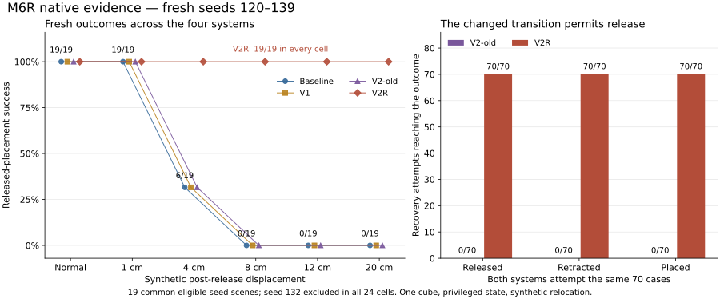

# M6R native results — effect-aligned lower-to-release transition

Date: 2026-10-06 (Asia/Shanghai).

The frozen V2R predicate change rescues all 70 attempted placement failures in
the fresh matrix, while V2-old aborts all 70 before release. V2R finishes with
released, supported, stable and retracted placement in every eligible selected
slot, with no observed unnecessary recovery or healthy-case regression. Strict
raw replay and common-prefix comparisons support the narrow causal attribution
to the lower completion contract in this setup. Independent research acceptance
remains with 02; Prototype A stays open.

## Frozen method and provenance

Authority: [DEC-0005 / 02's accepted M6 review](AETHER_CL_M6_02_Research_Review_v0.1.md)
at `33918f5f2da97c355a0c2d7cda60b448f77bb2a6`.
Measurement revision: clean `9ac5439e003f2ed65ecf2ea02f59a6186c7b6714`.
The [preregistered protocol](AETHER_CL_M6R_Placement.md) and
[machine freeze](evidence/AETHER_CL_M6R_Placement_Protocol.json) remain unchanged.

Baseline and V1 use the original M6 nominal policy; V2-old uses the unchanged
failed M6 recovery. V2R inherits its actions, target refresh, settings, durations,
one-attempt/400-retry/800-total budgets, verifier and terminal behavior. Only
recovery lower readiness changes: replace dedicated 3 mm TCP-Z attainment with
controller geometric table support and the existing 25 mm goal-XY tolerance.
Minimum three motion steps, 20 mm TCP distance, 0.15 rad orientation and attachment
monitoring remain. No evaluator grasp/contact/reference/success or disturbance
label enters recovery. All historical M0–M6 sources/results remain retained.

Known16 [development commissioning](AETHER_CL_M6R_Known16_Native.md) was audited
before starting fresh seeds. Its report hash is retained in both fresh snapshots.
The native history guard checked 2,235 event files, recorded resets only on seeds
0–119 and found no overlap with 120–139. This covers available native history;
it cannot certify the absence of deleted or unreported external runs.

Fresh matrix: normal plus 1/4/8/12/20 cm post-release world-Y cube shifts, seeds
120–139, four systems, 480 selected records / 24 cells. Each record uses a fresh
Python interpreter and simulator with CPU physics and no rendering. Python
3.10.22, NumPy 1.26.4, ManiSkill 3.0.1, SAPIEN 3.0.3 and the existing native stack
are retained. All five upstream source hashes match throughout the matrix and
the audited known commissioning. At step 296 the shift is a synthetic pose
relocation with zeroed velocities, before physics; it is not a force impulse.
All 380 eligible disturbed records apply the assigned shift; no release
precondition is missed and no failed outcome is replaced.

Seed 132 starts inside the horizontal target region and is excluded under the
unchanged preregistered eligibility rule, with zero actions in all 24 cells.
All 24 exclusion records remain. There are 456 eligible records, 19 per cell,
and 364,800 actions. The 19 common eligible seed scenes are reused across six
conditions; the 114 eligible records per system are not independent scenes.

First24 ran, passed its evidence/viability gate, remained in the final dataset
and was copied to an immutable pilot archive. The same detached parent environment
then launched only the remaining 456. There was no intervening source, parameter,
seed or motion change. All 120 pilot child files remain byte-identical in final.

## Independently checked endpoints

The score requires prior contact grasp and lift of at least 5 cm; an open release
command and current non-grasp/open geometry; geometric and contact table support;
goal XY error at most 25 mm; at least 8 cm vertical and Euclidean gripper clearance;
and five stable frames. The auditor reconstructs this conjunction directly from
raw pose, velocity, joint, action and contact fields at every action, separately
from the frozen reference/verifier replay.

| Condition | Baseline | V1 | V2-old | V2R |
| --- | ---: | ---: | ---: | ---: |
| Normal | 19/19 | 19/19 | 19/19 | 19/19 |
| 1 cm | 19/19 | 19/19 | 19/19 | 19/19 |
| 4 cm | 6/19 | 6/19 | 6/19 | 19/19 |
| 8 cm | 0/19 | 0/19 | 0/19 | 19/19 |
| 12 cm | 0/19 | 0/19 | 0/19 | 19/19 |
| 20 cm | 0/19 | 0/19 | 0/19 | 19/19 |
| Descriptive total | 44/114 | 44/114 | 44/114 | 114/114 |

The six 4 cm Baseline successes are seeds 122/124/130/133/135/137. They are passive
post-injection dynamics, with zero retry and final XY errors 12.469–18.846 mm.
They are not recovery rescues. The other 13 cases require recovery. The score
does not equate near-XY held cubes with placed cubes: failed V2-old endings are
4.277–8.274 mm from goal XY but remain contact-grasped and unretracted.

## Causal boundary and recovery stages

All 120 old/R pairs share exact reset, software, nominal policy, support, native
sources, physical observations/contact, actions, decisions, reference and verifier
through the first justified lower-state difference. Recovery and trigger states
also match before that boundary. The common boundary action/observation/verdict
are still exact; only post-observation lower readiness first differs.

There are 70 such differences, at steps 426–497, and actual first action differences
occur exactly one step later. The remaining 44 eligible no-attempt pairs have
full 800-action equality; six excluded pairs have equal zero-action records.
On every common boundary state:

- Retained motion/distance/orientation gates pass; orientation errors are
  0.000681–0.001279 rad and TCP distances 10.731–16.491 mm.
- Cube geometry is supported and goal XY error is 1.587–4.513 mm, within 25 mm.
- TCP vertical residual is 10.601–16.359 mm, above the old 3 mm condition.

Thus the recorded change is the authorized predicate substitution, with no
earlier divergence or altered motion primitive. Both recoveries trigger at 342
and execute their first retry action at 343. Detected failure follows the first
reference failure by two steps under the unchanged confirmation rule.

| Attempt outcome | V2-old | V2R |
| --- | ---: | ---: |
| Same eligible attempted cases | 70 | 70 |
| Lower phase timeouts | 70 | 0 |
| Release reached / executed | 0 / 0 | 70 / 70 |
| Retraction reached / executed | 0 / 0 | 70 / 70 |
| Attempt completion | 0 | 70 |
| Final recovery task success | 0 | 70 |
| Final contact-grasped endings | 70 | 0 |

Old retries fail `retry_lower_not_completed` after 40 lower actions, at steps
445–516. Their abort TCP-Z residuals remain 8.544–11.965 mm; TCP distance and
orientation satisfy the retained general tolerances. This is a local phase
timeout, not an 800-action or 400-retry deadline. Each aborted hold repeats its
final closed command through step 800 and never executes recovery release.

V2R release actions start at 427–498, retraction at 437–508, first task success
at 457–529 and attempt completion at 463–534. All 70 endings are non-grasped,
released, supported, stable and retracted. Final XY error is 0.437–4.116 mm.
They retain one attempt and the same terminal last-command hold through step 800.

## Paired rescues, healthy controls and costs

| Shift | Eligible pairs | R-only successes | Old-only successes | Both successes | R−old success difference |
| --- | ---: | ---: | ---: | ---: | ---: |
| Normal | 19 | 0 | 0 | 19 | 0 pp |
| 1 cm | 19 | 0 | 0 | 19 | 0 pp |
| 4 cm | 19 | 13 | 0 | 6 | +68.42 pp |
| 8 cm | 19 | 19 | 0 | 0 | +100 pp |
| 12 cm | 19 | 19 | 0 | 0 | +100 pp |
| 20 cm | 19 | 19 | 0 | 0 | +100 pp |

V2-old has no rescue relative to V1. V2R has the same 70 rescues relative to V1
and Baseline. Both recovery systems have zero unnecessary attempts and zero
regressions in the 44 eligible condition/seed pairs whose matched Baseline
succeeds. These are descriptive paired outcomes on common scenes, not 70
independent scene-level discoveries or a population-wide success guarantee.

| Shift | Mean R retry actions on attempts | Mean old retry actions on attempts | Mean extra R actions over all 19 pairs | Mean extra R total TCP path over all 19 pairs |
| --- | ---: | ---: | ---: | ---: |
| 4 cm | 130.615 | 112.462 | 12.421 | 84.907 mm |
| 8 cm | 141.526 | 123.211 | 18.316 | 122.132 mm |
| 12 cm | 158.316 | 140.000 | 18.316 | 123.122 mm |
| 20 cm | 191.737 | 173.421 | 18.316 | 123.275 mm |

Across the 70 actually attempted pairs, V2R averages 157.686 retry actions versus
139.400 old, adding 18.286 actions and 123.075 mm total TCP travel. R attempts
use 121–192 actions, old 103–174, all within the frozen 400 limit. Every eligible
episode still executes exactly 800 actions. Costs include failed old attempts
and the paired summaries include zero-attempt cases; 4 cm means therefore use
different denominators for attempt cost and all-pair cost. Full V1-relative
costs and endpoint differences are in the paired CSV.

## Archive and audit receipts

| Returned file | Bytes | SHA-256 |
| --- | ---: | --- |
| Final archive | 112,521,418 | `d3427dbdd9759ee018ad82182273462c6481869f54234e9d1523f4934857a391` |
| First24 pilot | 5,582,663 | `dc388e5bb6b96f4de838bab4494384de86cd38265327b6fb78e0ba80e149cbc0` |

All 2,404 final and 124 pilot indexed files have exact membership, size and raw
hash checks. All 480 child replays, 364,800 actions and 460 comparisons pass:
120 passive, 120 recovery, 120 repair and 100 normal/disturbed controls. The
460 includes 23 valid zero-action comparisons for the excluded seed. Both
aggregate reports, all 24 cells/six paired summaries, native source identity and
the two curve CSVs are reconstructed. Maximum action replay error is exactly zero.

Local independent replay uses Python 3.12.14, NumPy 2.3.5 and SciPy 1.17.0. In
21 repair-pair diagnostics the locally derived rotation angle differs from the
native report by at most `2.461267951600621e-13` rad. The auditor allows at most
`1e-12` rad only for that diagnostic, as in known16; all other fields, raw
physical/controller/verifier values and readiness booleans remain exact. No
physical comparison tolerance or controller gate changes. Native exact source,
software and resume checks remain intact.

Artifacts: [machine audit](evidence/AETHER_CL_M6R_Native_Audit.json),
[480 episode rows](evidence/AETHER_CL_M6R_Episode_Outcomes.csv),
[native curve](evidence/AETHER_CL_M6R_Native_Curve.csv),
[18 paired summary rows](evidence/AETHER_CL_M6R_Paired_Outcomes.csv),
[figure](evidence/AETHER_CL_M6R_Results.svg),
[read-only auditor](../../../tools/audit_m6r_return.py) and
[evidence/figure generator](../../../tools/m6r_publish_evidence.py).
The machine summary records archive/log/full-audit hashes, software, seed
provenance, every repair boundary, independently reconstructed endpoints and
per-attempt terminal behavior. Raw simulator trials are never rerun by the audit.

## Interpretation and return boundary

The evidence supports one limited claim: replacing the dedicated lower TCP-Z
condition with the frozen controller support/XY completion contract permits the
unchanged recovery to execute release and retraction and rescue these placement
failures. M6's earlier valid negative result stays valid for its original executor;
M6R identifies and repairs that executor's phase-completion bottleneck here.

This does not establish learning, sensor-based verification, general-world
manipulation, insertion or force robustness. It is one cube/task, privileged
state, deterministic CPU simulation and synthetic post-release relocation on
19 eligible fresh common scenes. There is no independent new-scene replication
beyond this preregistered matrix. No post-observation tuning or seed replacement
was introduced, and the engineering-known16 outcomes remain separate.

Return [this handoff to 02](AETHER_CL_M6R_Return_to_02.md) for independent research
acceptance before any correction or next experiment. Prototype A stays open;
PR #1 stays draft/unmerged and main unchanged. No next scope starts automatically.
