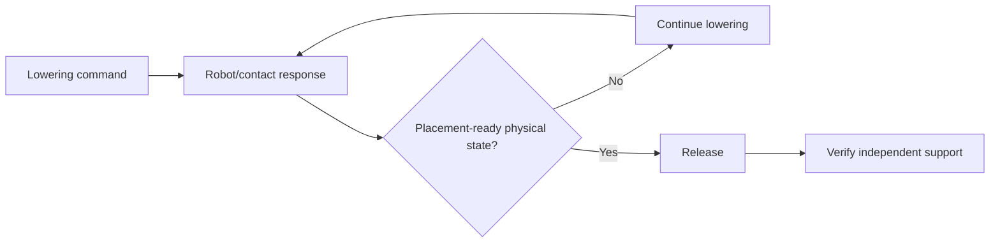

# AETHER-CL M6 — 02 Research Review and M6R Scope Decision

Date: 2026-10-06 (Asia/Shanghai)

Status: **02 accepts the M6 engineering result and negative placement-recovery
finding within its frozen scope. M6 does not demonstrate placement recovery.
Prototype A remains scientifically open.**

Authority: audited M6 evidence published at `3b2500f6539010fa39f1c4603e2902f678539316`, including
`AETHER_CL_M6_Results.md` and the M6 return-to-02 handoff.

## 1. M6 acceptance

02 accepts the audited M6 evidence:

- 360 retained trials, 259,200 actions and 340 strict paired/control comparisons;
- all replay, source/protocol, archive and independent endpoint-score checks pass;
- normal and 1 cm placement succeed 18/18 for Baseline/V1/V2;
- 4 cm succeeds 10/18 for all three systems;
- 8/12/20 cm succeed 0/18 for all three systems;
- V2 invokes exactly 62 recovery attempts and rescues none;
- V2 introduces no unnecessary recovery and no final-success regression;
- all 62 V2 attempts regrasp, lift and move the cube close to target XY, but
  abort in the recovery lower phase before release/retraction.

This is valid negative evidence. Earlier M3–M5 held-cube recovery success does
not transfer automatically to the released-placement endpoint.

## 2. Failure interpretation

The M6 failure is localized. It does not presently justify rejecting
verification-gated recovery as an architecture.

All 62 attempts end with:

- cube horizontal goal error 3.737–8.201 mm, inside the 25 mm task tolerance;
- cube table-supported while still contact-grasped;
- TCP-to-target distance 9.766–13.802 mm, inside the general 20 mm arrival gate;
- TCP vertical residual 7.592–12.001 mm, outside the dedicated 3 mm lower gate;
- zero recovery releases and zero recovery retractions.

The frozen source also reveals an important semantic mismatch:

- **nominal placement** advances from lower to release by elapsed phase time;
- **recovery placement** refuses to advance from lower until a stricter
  end-effector arrival predicate is satisfied, including
  `abs(tcp_z - target_z) <= 3 mm`.

The task endpoint, however, concerns the **object** becoming positioned,
released and independently supported. In the failed attempts the object is
already close to the task target and geometrically/table supported while the
closed gripper remains in contact. Continuing to demand an exact low TCP target
under contact can be inconsistent with the physical state needed for the next
task transition.

02 therefore treats the 3 mm gate as a demonstrated **candidate bottleneck**,
not as a proven universal cause and not as a threshold to tune post hoc.

## 3. Architectural lesson

M6 exposes a distinction AETHER must preserve:

> **Controller-space completion is not the same as task-effect completion.**

A manipulation phase should not be considered incomplete merely because an
end-effector target remains imperfect if the intended physical effect needed by
the next phase has already been achieved.

This strengthens the earlier working ideas around distributed verification and
skill/state-transition semantics:

The point is **not** to remove low-level servo checks. It is to align phase
transition criteria with the physical effect the skill is supposed to establish.

This is a new working hypothesis from M6:

> **Effect-aligned phase completion:** in contact-constrained manipulation,
> recovery transitions defined by task-relevant object/contact state may be more
> robust than transitions defined only by exact end-effector target attainment.

## 4. H3/H4 status

### H3 — verification as selective intervention

M6 does not weaken the M5 finding. V2 attempts recovery only on paired failures
and creates no unnecessary intervention/regression. Verification gating behaves
as intended.

### H4 — recovery as intelligence

M6 narrows the claim:

> Recovery only improves autonomy when the recovery executor can actually
> complete the task-relevant corrective state transition.

Detection and invocation are insufficient when the recovery phase contract is
misaligned with attainable physical interaction.

M6 therefore identifies an executor/interface limitation rather than evidence
that recovery is unnecessary.

## 5. Do not proceed to insertion yet

02 does **not** authorize M7 insertion immediately.

Insertion would add a harder contact-rich task while the existing placement
recovery executor is known to terminate at a task/phase boundary mismatch. That
would confound whether future failures arise from insertion difficulty or from
an already broken recovery transition contract.

The correct next step is a narrow placement-recovery correction study.

## 6. Next engineering round — M6R Effect-Aligned Lower-to-Release Transition

### Research question

> If the recovery motion is unchanged, does replacing the recovery lower
> phase's strict absolute vertical-completion gate with a task-relevant
> placement-ready condition allow successful release/retraction/reverification?

### Systems

Use a fresh matched four-system matrix:

- **Baseline** — frozen M6 nominal placement controller;
- **V1** — frozen M6 passive verifier;
- **V2-old** — frozen M6 recovery executor, including the 3 mm lower gate;
- **V2R** — identical to V2-old except for the lower-to-release phase transition
  criterion described below.

Do not overwrite or silently redefine V2. The failed M6 V2 remains preserved.

### V2R change — one factor only

Keep the existing recovery motion commands, target refresh, phase ordering,
durations, action budget, attempt count, verifier, disturbance, task scoring,
release/retraction logic and all non-lower transition logic unchanged.

For the recovery **lower** phase only:

- retain the existing minimum motion-step requirement;
- retain the existing general TCP distance gate (20 mm);
- retain the existing rotation gate (0.15 rad);
- retain the existing attachment-loss monitoring;
- **remove the dedicated 3 mm TCP vertical residual requirement**;
- instead require the already available controller-side privileged geometry to
  indicate:
  - cube `supported_geometry == true`; and
  - cube horizontal goal error <= the frozen 25 mm task tolerance.

The controller must not consume evaluator contact-force labels, `is_grasped`,
built-in environment success, disturbance identity or reference outputs.

This is a semantic substitution, not a post-hoc relaxation to 8/10/12 mm based
on the observed residual range.

If engineering identifies that these exact inputs cannot support a safe/fair
single-factor implementation, return to 02 before native evaluation rather
than broadening the repair.

### Why this comparator is scientifically useful

V2-old and V2R can share the same physical trace through recovery until the
first moment V2R's effect-aligned lower gate permits release. Their divergence
therefore directly tests the phase-transition contract while keeping the
recovery motion itself fixed.

### Development versus evaluation

Because the M6 failure mechanism is already observed, 06-01 may use archived M6
traces and/or already-observed M6 seeds for **engineering commissioning only**.

Those runs are development evidence and must not be presented as confirmatory
M6R results.

After the V2R protocol is frozen, use fresh preselected native seeds. Preferred
next unused set: **120–139**, unless repository provenance shows they have
already been observed.

### Frozen evaluation matrix

Prefer the same M6 condition family for comparability:

- normal;
- 1 cm post-release shift;
- 4 cm;
- 8 cm;
- 12 cm;
- 20 cm;

across Baseline/V1/V2-old/V2R.

Selected design: 20 seeds × 6 conditions × 4 systems = 480 slots before
retained zero-action exclusions.

No adaptive seed replacement.

### Audit requirements

Retain all prior M6 evidence discipline and add:

- Baseline/V1 complete physical equality;
- V1/V2-old causal-prefix equality;
- V2-old/V2R complete equality on no-attempt episodes;
- V2-old/V2R equality through the common recovery trajectory up to the first
  lower-phase transition divergence;
- identical verifier verdicts and trigger timing for V2-old/V2R before that
  divergence;
- exact disturbance and reset matching;
- source/protocol/hash guards;
- preserve every failed/aborted episode.

### Required metrics

Report separately:

- final released-placement success;
- recovery attempt success;
- recovery release reached/executed;
- recovery retraction reached/executed;
- support/stability success;
- V2R-only and V2-old-only paired successes;
- lower-phase transition step;
- lower-phase timeouts;
- action/TCP-path cost;
- final horizontal error;
- controller completion versus task success;
- any healthy-control regression.

### Interpretation

- **V2R rescues placement failures:** supports effect-aligned phase completion
  as a meaningful recovery-interface improvement.
- **V2R reaches release but still fails later:** the 3 mm gate was one real
  bottleneck, but downstream release/retraction/stability becomes the next
  measured limitation.
- **V2R does not reach release:** the proposed placement-ready condition or
  another retained gate is still insufficient; do not tune thresholds after
  native results.
- **V2R causes healthy regressions:** the new transition is too permissive or
  otherwise unsafe for this task and must be reconsidered.

## 7. Deferred work

M6R does **not** authorize:

- insertion;
- physics-propagated disturbance claims;
- non-privileged sensor verification;
- memory/experience learning;
- world models;
- Prototype B/C/D;
- foundation-model integration;
- general motion optimization;
- arbitrary tolerance tuning.

The original M6 negative evidence remains part of the research record.

## 8. 02W decision

**Do not activate 02W for M6R.**

The failure is sufficiently localized to support one discriminating engineering
correction. 02W remains more appropriate for the later non-privileged verifier
design or another consequential architecture choice with multiple serious
alternatives.

## 9. Return boundary

Return to **06-01 — AETHER-CL** for **M6R only**.

After implementation, frozen fresh-seed native execution and independent audit,
return to 02 before insertion or any other Prototype A scope.

PR #1 remains draft/unmerged unless separately accepted.
