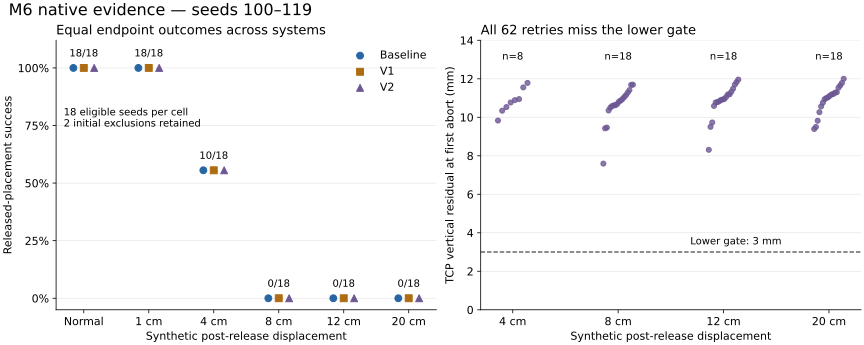

# AETHER-CL M6 — Audited native placement results

Date: 2026-10-06 (Asia/Shanghai).

**M6 implementation, native execution and independent evidence audit are complete.
V2 produces no placement-success improvement: every required recovery aborts
before release. Return to 02 for review; Prototype A remains open.**

Authority is [02's M5 acceptance and DEC-0004](AETHER_CL_M5_02_Research_Review_v0.1.md).
The [preregistered placement protocol](AETHER_CL_M6_Placement.md) was executed
unchanged at `7059c713d3b36e3f032aab8d1f87662ed6fdab91`, with a clean checkout.
This publication adds audit tooling and evidence, not a tuned controller.

## Endpoint results

Success requires historical contact grasp and lift, actual release, designated
table support, horizontal goal error at most 25 mm, gripper retraction, and five
fresh stable observations. Reaching goal XY while holding the cube is insufficient.

| Condition | Baseline | V1 | V2 | V2 attempts / eligible | V2-only successes |
| --- | ---: | ---: | ---: | ---: | ---: |
| Normal | 18/18 | 18/18 | 18/18 | 0/18 | 0 |
| Post-release shift 1 cm | 18/18 | 18/18 | 18/18 | 0/18 | 0 |
| Post-release shift 4 cm | 10/18 | 10/18 | 10/18 | 8/18 | 0 |
| Post-release shift 8 cm | 0/18 | 0/18 | 0/18 | 18/18 | 0 |
| Post-release shift 12 cm | 0/18 | 0/18 | 0/18 | 18/18 | 0 |
| Post-release shift 20 cm | 0/18 | 0/18 | 0/18 | 18/18 | 0 |
| Total | 46/108 | 46/108 | 46/108 | 62/108 | 0 |

Each cell requests all 20 seeds, 100–119. Seeds 107 and 111 start within the
horizontal target tolerance and are consistently retained as zero-action
exclusions in every condition/system: 36 excluded trials, 324 eligible trials.
These are 20 common initial scenes across conditions, not 360 independent scenes.
All 270 eligible disturbed episodes receive the frozen positive-world-Y synthetic
pose relocation at step 296; no release precondition is missed. Normal and 1 cm
placements succeed without intervention. V2 makes no unnecessary attempts and
causes no final-success regressions, but rescues none of the 62 paired V1 failures.



The 10 successful 4 cm cases also succeed with the fixed Baseline: recorded
post-shift physics brings the cube back within tolerance before failure detection.
They are not V2 rescues. Open-finger interaction during nominal retraction is a
possible explanation, but the recorded cube/table forces do not establish the
specific mechanism. No direct finger-contact attribution is claimed.

## Why all 62 recoveries fail

Every V2 attempt regrasped and lifted the cube, transported it near the projected
goal, then exhausted its 40-action **lower-phase** allowance with
`retry_lower_not_completed`. It never entered recovery release or retraction.

| Measurement at first abort | All 62 attempts |
| --- | --- |
| Abort global step | 448–516 |
| Retry actions consumed | 106–174, within the 400-action retry cap |
| TCP-to-target distance | 9.766–13.802 mm, within the 20 mm position gate |
| TCP vertical residual | 7.592–12.001 mm, outside the 3 mm lower gate |
| Rotation residual | 0.01738–0.17732 rad; one also exceeds the 0.15 rad gate |
| Cube horizontal goal error | 3.737–8.201 mm, within the 25 mm task tolerance |
| Cube still contact-grasped / table-supported | 62/62 for both |
| Cube vertical table-contact force | 17.664–30.371 N |
| Retry lift above cached cube height | 99.776–104.672 mm |
| Recovery release executed | 0/62 |
| Final cube still contact-grasped | 62/62 |

Thus all failures violate the vertical arrival predicate; one also violates the
orientation predicate. They are not global-budget timeouts. The frozen recovery
aborts and repeats its final closed-gripper absolute command through step 800.
At the endpoint, failed Baseline/V1 placements remain released, stably supported
and retracted but off target. V2 improves cube XY proximity while failing release,
stability and clearance. The raw traces establish a mismatch between attainable
contact-constrained lowering and the strict arrival gate; they do not identify
which controller, target geometry or phase-transition correction should be chosen.

For example, 8 cm / seed 100 / V2 aborts at step 465 after 123 retry actions:
TCP Z 33.053 mm versus target Z 22.000 mm; cube XY error 5.568 mm; closed contact
grasp; table force 21.245 N. The simulator's own success flag can be true here,
while M6's independently replayed released-placement score remains false.

Failure is first phase-eligible at step 340, confirmed at 342, and retry starts
at 343. The reported two-step confirmation latency is measured from 340,
not from the injection at 296. Verification uses privileged simulator geometry;
the phase-aware reference and terminal checks limit interpretation of its dense
precision/recall. Hard-cell V2 recall is 0.5; this is not evidence of camera-based
monitoring or continuous diagnosis during the aborted hold.

## Costs and bounded interpretation

| Condition | Mean retry actions, V2 minus V1 per eligible pair | Mean extra TCP path |
| --- | ---: | ---: |
| Normal | 0 | 0 m |
| 1 cm | 0 | 0 m |
| 4 cm | 48.778 | 0.1703 m |
| 8 cm | 123.111 | 0.4483 m |
| 12 cm | 139.944 | 0.5290 m |
| 20 cm | 173.444 | 0.6882 m |

All eligible systems still execute the equal 800-action episode budget; retry
actions are phase-labelled work within that budget, not extra episode steps.
The 4 cm means include ten non-attempted successful pairs and eight aborted
attempts. Failed attempts remain in costs. More motion and smaller XY error do
not establish successful placement recovery.

M6 establishes viable native released/support/stable placement under normal and
small-shift conditions, plus a repeatable recovery-execution limitation. It does
not extend M3–M5 held-cube recovery successes to released placement. No general
claim against verification or recovery follows from this single frozen executor.
The result warrants a scoped 02 decision before any correction or new experiment.

## Evidence and independent verification

| Archive | Bytes | SHA-256 |
| --- | ---: | --- |
| Final: `aether-cl-m6-placement-seeds100-119.tar.gz` | 78,444,880 | `21b1739df6a8f66ecb2af5bb6dc865b3b96d7ffbb44ebbec030237ace2b3843e` |
| Pilot: `aether-cl-m6-placement-seeds100-119-pilot.tar.gz` | 4,118,276 | `abc010ff900bab2f507f866046125ad86726e146f63c5e156274448990d0a1a5` |
| Before repair: `aether-cl-m6-before-report-repair.tar.gz` | 207,956 | `cd22ce263eb507be262064c3da6bfeff7a86fba2d68d95c6d163da9909de09c3` |

All three uploaded archives match these hashes. Safe extraction rejects unsafe
members and duplicate names. All 1,804 final indexed files and 94 pilot indexed
files match sizes/hashes and exact archive membership; every per-trial file list
also matches. All 360 retained trial replays pass, covering 259,200 actions with
maximum action replay error **0.0**. Controller decisions, reference, verifier,
recovery state, endpoint scores, injections, paths, manifests and results replay.
A separately implemented endpoint scorer also agrees at every recorded step.

All 120 Baseline/V1 comparisons, 120 V1/V2 causal-prefix comparisons and 100
normal/disturbed controls pass: **340/340**. Pilot comparison counts are 6/6/4.
Native aggregate JSON and curve CSV reproduce exactly for both pilot and final
under Python 3.12.14 / NumPy 2.3.5, including the frozen ordered float accumulation.
No tolerance, check or outcome was waived. Local files before this publication
matched all 113 blobs of the authoritative report-helper branch revision.

The [report-only repair](AETHER_CL_M6_Reporting_Repair.md) preserved the completed
first child byte-for-byte, adopted it after replay, and ran only unstarted slots.
The before-repair backup, first 18 pilot records, their raw files and final prefix
all agree. Reconnection changed only `XDG_SESSION_ID` from 876 to 879; restoring
the recorded value recovered the original full environment hash. No guard was
relaxed. A pilot check attempted from base Conda failed on missing SciPy, then
passed in the original `aether-cl` environment; it did not rerun trials.

Native environment: Python 3.10.22, NumPy 1.26.4, torch 2.4.1+cu121, ManiSkill
3.0.1, SAPIEN 3.0.3, Gymnasium 1.1.1, Pillow 11.3.0; Linux 5.15.0-191-generic,
four A100 80 GB PCIe devices, driver 595.91.07, `CUDA_VISIBLE_DEVICES=1`.
CPU physics, no rendering. Five installed native source identities agree across
all trials. Raw archives contain measurements, not videos; live demonstrations
remain separate runs.

Inspect the [machine audit](evidence/AETHER_CL_M6_Native_Audit.json),
[all 360 episode outcomes](evidence/AETHER_CL_M6_Episode_Outcomes.csv), and
[native aggregate curve](evidence/AETHER_CL_M6_Native_Curve.csv).
Reproduce with [tools/audit_m6_return.py](../../../tools/audit_m6_return.py):

```bash
python tools/audit_m6_return.py \
  --evidence-root /path/to/safely-extracted-archives \
  --upload-root /path/to/original-archives \
  --output /path/to/new-audit.json
python tools/m6_publish_evidence.py --audit /path/to/new-audit.json \
  --curve /path/to/final/m6-placement/curve.csv
```

Extraction directories must match archive names, containing `m6-placement` for
final/pilot and `m6-before-report-repair` for the backup. Requires the repository's
analysis dependencies, NumPy/SciPy and matplotlib for figure publication; no
simulator is launched by the audit. The frozen server execution remains unchanged.

## Return boundary

The [return to 02](AETHER_CL_M6_Return_to_02.md) requests review of the negative
placement-recovery result and a decision on any narrowly scoped follow-up.
No controller correction, next task or hypothesis-register edit is made here.
PR #1 remains open, draft and unmerged; main is unchanged. Insertion, physical
force disturbances, sensor verification, memory/world models, Prototype B/C/D,
foundation-model integration and 02W remain outside this round.
