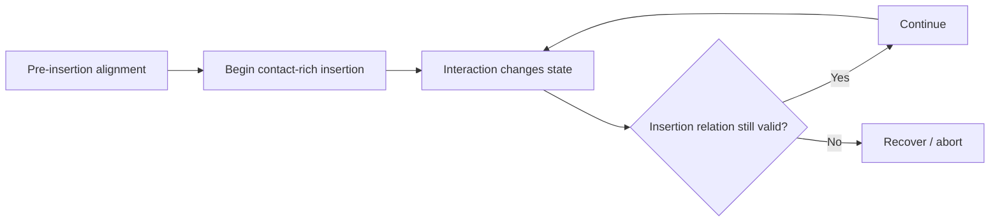

# AETHER-CL M7 — 02 Research Review and M8 Scope Decision

Date: 2026-10-08 (Asia/Shanghai)

Status: **02 accepts M7 Contact-Rich Insertion within its frozen scope. M7
demonstrates bounded transfer of the verification/recovery pattern to insertion.
Prototype A remains scientifically open.**

Authority: audited M7 evidence published at `1d05d0604563113c607a29508953af2c8c519749`, including
`AETHER_CL_M7_Results.md`, its independent machine audit and the M7
return-to-02 handoff.

## 1. M7 acceptance

02 accepts the audited M7 result:

- 360 retained episodes on fresh seeds 140–159;
- 432,000 replayed actions, 432,000 independently reconstructed endpoints and
  2,160,000 external physics samples;
- all 340 matched comparisons pass without post-outcome tolerance changes;
- Baseline and passive V1 achieve 18/20 on normal and 1.5 mm offset, and 0/20
  at 3/6/12/24 mm;
- V2 achieves 18/20 in every condition;
- V2 produces 72 paired rescues across the four harder offset levels;
- one easy Baseline-success case receives an unnecessary recovery, with no
  final healthy-case regression;
- seeds 143 and 155 remain failed in every condition and remain counted.

The 72 rescues reuse 18 common scenes across four harder conditions and must not
be represented as 72 independent scene-level discoveries.

## 2. Supported research claim

The supported claim is:

> **In this privileged-state rigid single-arm insertion task, a
> verification-gated one-episode retreat, geometry refresh, realignment and
> reinsertion pattern extends a fixed controller's success across the frozen
> synthetic lateral-misalignment family.**

M7 therefore extends AETHER-CL beyond held transport and released support
placement into a contact-rich insertion endpoint whose success is scored from
the object-target relation rather than controller completion.

M7 does not prove universal insertion recovery, non-privileged perception,
physics-disturbance robustness, learning or foundation-model capability.

## 3. Hypothesis updates

### H4 — recovery as intelligence

Status: **stronger bounded support across task semantics.**

Recovery benefit now appears in held-cube transport, released placement after
the M6R phase-contract repair, and contact-rich insertion. However, M7 also
retains two persistent scene failures, showing that one bounded recovery episode
does not constitute general manipulation competence.

A more precise working formulation is:

> Recovery is a task-conditioned capability whose usefulness depends on
> appropriate invocation, task-effect-aligned phase semantics and whether the
> available corrective strategy matches the failure class.

### H3 — verification as selective intervention

Status: **supported but temporally imperfect.**

M7 has one unnecessary easy-case recovery (seed 150): V2 intervenes on a
confirmed transient instability while the matched Baseline later succeeds
without intervention. Another transient (seed 152) is filtered and receives no
recovery.

This exposes a new design consideration:

> Verification quality includes not only whether a deviation is detected, but
> whether its persistence/severity justifies intervention at that time.

The verifier therefore participates in a **temporal intervention policy**, not
merely a binary success/failure classifier.

### H7 — adaptive capability allocation

Status: **further bounded support, with a calibration tradeoff.**

M5 showed that invoking recovery when it is unnecessary can be costly or
harmful. M7 shows the complementary difficulty: deciding when a transient has
become intervention-worthy. Capability orchestration needs both selectivity and
appropriate temporal persistence.

## 4. Additional architectural lessons

### Controller completion remains insufficient

Baseline/V1 complete their controller schedule in all 120 episodes despite 84
task failures. M7 again demonstrates:

> **controller completion != physical task success**

Independent object-target state remains necessary for evaluation and
verification.

### Readiness must be revalidated during contact-rich execution

Seed 155 backs out, refreshes and realigns successfully, then becomes misaligned
again during reinsertion and stalls near entry. A state that is valid before
contact is not guaranteed to remain valid through contact.

This supports continuous/distributed verification:



The result does not yet prescribe a new controller; it strengthens the
architectural requirement that physical readiness may require revalidation
during execution.

## 5. Prototype A closure status

Task-semantic coverage now includes:

- held target-reaching recovery;
- actual support placement/release recovery;
- contact-rich insertion recovery.

Prototype A still lacks two planned closure dimensions:

1. at least one **physics-propagated disturbance** study;
2. at least one **non-privileged sensor-based verifier** study.

02 selects the physics-propagated disturbance next because it can be tested while
keeping the currently validated privileged-state verification interface fixed.
Changing disturbance realism and sensing realism simultaneously would confound
interpretation.

## 6. Next engineering round — M8 Physics-Propagated Placement Disturbance

02 authorizes **M8 Physics-Propagated Placement Disturbance only**.

### Research question

> Does the validated AETHER-CL selective verification/recovery loop retain value
> when a post-release placement disturbance is produced through simulator
> dynamics rather than direct pose/waypoint modification?

### Why return to the placement task

M8 should use the M6R released-placement stack rather than introduce another new
task. Placement provides:

- a validated released/support/stable endpoint;
- a validated one-episode regrasp/re-place/release recovery;
- a clean post-release intervention point;
- fewer contact/control confounds than insertion.

This isolates **disturbance mechanism** as the major changed dimension.

### Systems

Use a matched three-system matrix based on the accepted M6R placement task:

- **Baseline** — frozen nominal placement controller;
- **V1** — identical physical controller + passive privileged-state verifier;
- **V2** — the accepted effect-aligned placement recovery (M6R V2R behavior),
  verification-gated, one bounded episode.

Historical M6 V2-old is not needed in the M8 matrix.

### Disturbance semantics

Replace synthetic pose relocation with a disturbance transmitted through the
physics engine.

Preferred implementation:

> apply a preregistered horizontal force/impulse to the released cube through
> the simulator's supported force/impulse API for a fixed duration/substep
> window, allowing subsequent displacement, rotation and contacts to emerge
> from physics.

Requirements:

- do **not** set cube pose to the desired displaced pose;
- do **not** directly overwrite cube linear/angular velocity as the disturbance;
- do **not** choose force magnitude from runtime verifier/reference output;
- record exact world-frame force/impulse vector, duration/substeps and application
  timing in every episode;
- retain CPU-physics/source identity guards.

If the installed SAPIEN/ManiSkill interface cannot apply a reproducible force or
impulse without materially redesigning the environment, return to 02 before
substituting a kinematic pusher, velocity overwrite or another mechanism.

### Timing

Prefer the same semantic intervention region as M6/M6R:

- nominal release has occurred;
- cube is independently supported;
- controller is in the nominal retract/post-release interval;
- final stability has not yet been accepted.

Use a fixed preregistered action boundary plus a minimal physical precondition;
do not trigger the disturbance from V1/V2 verifier verdicts or final task score.

If the precondition is not met for a selected episode, retain the episode and
record non-application rather than retiming or replacing the seed.

### Magnitude family

Exact force/impulse magnitudes depend on cube mass, friction and simulator API
and therefore are **not set by 02 here**.

During development-only commissioning, choose a monotonic family that includes:

- no disturbance;
- one small/easy impulse that usually remains recoverable/inside tolerance;
- multiple increasing impulses that create meaningful placement failures without
  trivially ejecting the cube from the usable workspace.

Prefer a six-point curve analogous to earlier robustness studies.

Freeze magnitudes, timing, duration and direction before fresh native outcomes.
Do not retune them after observing fresh-study results.

Use a single horizontal direction initially. Angular/contact variants are
deferred unless a clean translational family cannot be commissioned.

### Fresh seeds

Preferred fresh range: **160–179**, only if the native-history guard confirms
those reset seeds have not already been observed. Otherwise use the next unused
contiguous range and record provenance.

No adaptive replacement.

### Success and recovery semantics

Keep the accepted M6R independent endpoint:

- actual release;
- designated support;
- goal-region satisfaction;
- gripper clearance;
- consecutive stability.

V2 retains one bounded recovery episode using the accepted effect-aligned
placement logic.

Do not redesign placement motion, change task tolerance or add additional
recovery attempts in M8 unless 02 separately authorizes a correction after a
returned result.

### Required measurements

Report at minimum:

- disturbance application/precondition coverage;
- applied force/impulse and duration;
- resulting peak/post-disturbance cube displacement and velocity;
- final placement success;
- passive detection/diagnosis timing;
- V2 recovery attempts/rescues;
- unnecessary recovery/regression on Baseline-success pairs;
- recovery phase completion;
- action/TCP-path cost;
- final horizontal error;
- controller completion versus task success;
- robustness curve versus physical disturbance magnitude.

### Audit requirements

Retain the established evidence discipline:

- fresh isolated episode processes;
- source/protocol/hash guards;
- Baseline/V1 full physical equality;
- V1/V2 equality through first recovery divergence;
- exact reset and disturbance-command matching;
- independent endpoint reconstruction;
- record the physical disturbance command separately from resulting state;
- no post-native tolerance relaxation;
- preserve all failed/aborted/non-applied/excluded episodes.

The audit must establish that the disturbance is not implemented by hidden pose
or velocity teleportation.

## 7. Deferred work

M8 does **not** authorize:

- non-privileged RGB/RGB-D verification;
- memory/experience learning;
- world models;
- Prototype B/C/D;
- foundation-model integration;
- general motion optimization;
- new insertion tuning.

## 8. 02W decision and expected next routing

**Do not activate 02W for M8.**

M8 is a bounded change in disturbance mechanism.

However, if M8 closes the physics-propagated-disturbance dimension without
revealing a new blocking architecture issue, **the expected next step is 02W
before the final non-privileged-verification round**.

That 02W investigation should compare realistic verifier architectures
(RGB/RGB-D geometric state estimation, learned success/failure detection,
multimodal/VLM verification and hybrid approaches) and design M9 before returning
to 06-01.

Thus the expected route is:

```text
M8 in 06-01
  -> return to 02
  -> if accepted, activate 02W for non-privileged verifier design
  -> return to 02 for decision
  -> M9 implementation in 06-01
```

This routing remains conditional on M8 evidence.

## 9. Return boundary

Return to **06-01 — AETHER-CL** for **M8 only**.

After M8 implementation, frozen fresh-seed native execution and independent
audit, return to 02. Do not automatically begin sensor verification or any other
Prototype A/B/C/D work.

PR #1 remains draft/unmerged unless separately accepted.
