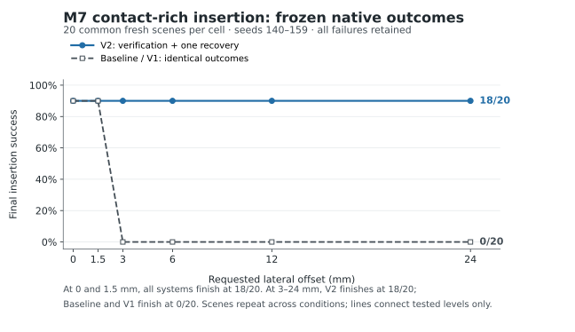

# AETHER-CL M7 — contact-rich insertion results

Reviewed 2026-10-08 UTC. The frozen native matrix is complete and independently audited. This is the 06-01 evidence return to 02, **not an 02 acceptance or authorization for another round**. Native measurement remains `a51e5d2073c4033141b26e956804d593aa45d6df`; the publication adds evidence and an external read-only reviewer without changing measurement code, task assets, thresholds, seeds or budgets.

## Result and supported claim

Verification plus one bounded recovery extends this fixed controller's insertion success across the frozen synthetic lateral-offset family. At each of 3, 6, 12 and 24 mm, Baseline and passive-verification V1 succeed in 0/20 scenes; recovery V2 succeeds in 18/20. V2 preserves the 18/20 normal and easy outcomes. Two scenes fail in every condition, including normal; one easy scene receives an unnecessary recovery relative to its matched Baseline's eventual success. All these outcomes remain in the denominators.

The supported claim is narrow: **in this privileged-state, rigid single-arm insertion task, verification-gated retreat, geometry refresh, realignment and one reinsertion rescued 72 failed scene-condition pairs while producing no observed final regressions in 36 Baseline-success pairs.** This transfers the verification/recovery pattern to insertion. M7 does not isolate effect-aligned phase completion as the sole causal factor, establish universally effective recovery, or prove training or sensor robustness.

## Frozen experiment

Authority is DEC-0006 / 02's M6R acceptance at `145aadce249b23a49ecb899ff273e93f673dd03b`. The [preregistration](AETHER_CL_M7_Insertion_Preregistration.md), [machine protocol](evidence/AETHER_CL_M7_Insertion_Protocol.json) and [freeze receipt](evidence/AETHER_CL_M7_Freeze_Receipt.json) precede fresh outcomes. Installed ManiSkill 3.0.1 `PegInsertionSide-v1` uses `panda_wristcam`, a rigid square peg/channel and approximately 3 mm clearance. Installed simulator/task/asset identities remain those inspected during development; no custom environment was built.

Baseline runs the fixed insertion controller. V1 runs identical motion plus passive verification. V2 shares that motion until a confirmed failure and has one recovery episode: back out, refresh object/target/grasp geometry once, realign, reinsert, then verify. Earlier acquisition failure consumes the episode. Caps are 420 recovery actions, stage caps 120/120/140/40 and 1,200 total actions. Terminal failure receives no second attempt.

The controlled disturbance biases cached nominal pre-insertion waypoints along target-local positive Y starting at action 431, before insertion/contact when the physical readiness condition passes. It is synthetic waypoint bias, not a force impulse or actor teleport. Six frozen clearance ratios 0/0.5/1/2/4/8 correspond to nominal 0/1.5/3/6/12/24 mm. Magnitudes were selected in [known-seed commissioning](evidence/AETHER_CL_M7_Candidates_v5_Review.json) on scenes 100/101 before the fresh run.

All 360 episodes are retained: 20 common fresh reset scenes, seeds 140–159, across six conditions and three systems. There are **20 common scenes, not 360 independent scenes**; the 72 rescues reuse 18 scenes across four harder conditions. No exclusions, seed replacements or outcome-based reruns occur. Entry and resume history each inspect 2,776 retained prior event files, with reset seeds 0–139 and no selected overlap. The guard cannot establish the absence of deleted or unreported runs.

## Success and stability semantics

Independent scoring requires valid bilateral contact acquisition and at least 30 mm lift, acceptable object-target orientation (0.05 rad modulo square symmetry), insertion depth between 0.8 and 1.2 peg half-length, and clipped inserted-volume channel margin at least −0.2 mm. Stability requires ten eligible 20 Hz observations, each with all five external 100 Hz physics samples satisfying the insertion relation. Pose-derived speed bounds are 10 mm/s and 0.15 rad/s; control-frame and whole 50-sample window translation/rotation bounds are 0.5 mm / 0.01 rad.

Built-in environment success is logged only and does not drive the controller or independent score. Raw solver velocities and the old velocity-based score remain shadow diagnostics; all 360 old-rule final shadows are false. The active criterion was frozen before fresh execution, and prior failed development outcomes retain their original scores. External samples do not expose internal solver iterations. Final verification holds the peg grasped; it does not establish released/post-release stability.

## All retained native outcomes

| Nominal lateral offset | Baseline | V1 | V2 | V2 attempts | Successful recovery episodes | Paired rescues |
| --- | --- | --- | --- | --- | --- | --- |
| 0 mm | 18/20 | 18/20 | 18/20 | 2 | 0 | 0 |
| 1.5 mm | 18/20 | 18/20 | 18/20 | 3 | 1 | 0 |
| 3 mm | 0/20 | 0/20 | 18/20 | 20 | 18 | 18 |
| 6 mm | 0/20 | 0/20 | 18/20 | 20 | 18 | 18 |
| 12 mm | 0/20 | 0/20 | 18/20 | 20 | 18 | 18 |
| 24 mm | 0/20 | 0/20 | 18/20 | 20 | 18 | 18 |
| Total scene-condition episodes | 36/120 | 36/120 | 108/120 | 85 | 73 | 72 |

V2 rescues 72/84 Baseline-failed scene-condition pairs. The remaining 12 are the two persistent failed scenes repeated across six conditions. There are zero final regressions in 36 Baseline-success pairs and **one unnecessary recovery in those 36 pairs**, under the frozen final-Baseline-success definition. “73 successful recoveries” counts the easy unnecessary retry; it must not be reported as 73 rescues. Whole-matrix totals describe this selected family, not an unbiased distribution of insertion difficulty.

Baseline and V1 declare controller completion in all 120 episodes each, including 84 task failures each. V2 completes its schedule in 108/120, all of which satisfy the independent final task score. This directly demonstrates why controller completion alone cannot score insertion.

Each system applies 95/100 requested nonzero injections. Seed 143 fails acquisition and misses all five nonzero readiness checks; these 15 missed injections across systems remain failed outcomes. For the 95 applied Baseline scene-condition pairs, pre-insertion object-target displacement relative to the matched normal scene tracks the requested Y bias within 0.053315 mm. Maximum unintended X/Z changes are 0.031110 / 0.151791 mm. These diagnostics describe applied injections only; the primary success denominators remain 20.

## Retained failures and verifier timing

**Seed 143 — acquisition failure in every condition.** The independent reference first reports `GRASP_FAILURE` at action 168; V1/V2 confirm at 170 and V2 consumes its single episode at 171. No valid acquisition or injection follows. V2 records `acquisition_or_attachment_unavailable_consumes_single_episode`, with zero corrective actions and no completed recovery stage. The final peg remains outside the target. The physical cause of failed grasp acquisition is not isolated by this experiment.

**Seed 155 — nominal and retry insertion failure in every condition.** Acquisition and precontact readiness pass. Even the normal Baseline stops near the channel entrance: final depth −0.116888 mm, lateral error 11.890422 mm, channel margin −1.031071 mm. Normal V2 confirms lateral interference at 642 and begins recovery at 643. It completes backout at 667 and realign at 675; reinsertion then exhausts its 140-action stage at 815. Final depth is −0.117551 mm, lateral error 12.036763 mm and channel margin −1.123603 mm. Across all six V2 conditions, backout, one refresh and realignment complete, but reinsertion never establishes its physical readiness relation; final depths are approximately −0.117 to −0.119 mm and lateral errors 11.898–12.896 mm. Alignment at retreat therefore did not ensure alignment during reinsertion. The raw trace establishes renewed misalignment and entry stall, not a uniquely proven motor, grip or contact-model cause.

**Easy seed 150 — unnecessary intervention without final regression.** At 630 the reference reports depth not achieved; at 640–642 the peg is still moving and both reference and verifier report instability. Verification confirms `INSERTION_UNSTABLE` at 642; V2 starts at 643 and completes a 229-action recovery with first task success at 871. Matched Baseline/V1 continue settling and first succeed at 657. V2 adds 339.677 mm total TCP travel relative to V1. This is an unnecessary attempt by the frozen final-outcome definition, despite detecting a real temporary failure of readiness. The first-onset diagnosis is depth failure while the later confirmed label is instability, so the strict first-label metric records a mismatch.

**Normal seed 152 — filtered transient.** Reference reports instability at 630 and first success at 631; V1/V2 do not confirm the transient and make no recovery. The frozen episode-first-onset metric records one missed reference failure per verifier, although this healthy scene succeeds without intervention. Do not relabel or silently omit it.

For each of V1 and V2, 85/86 episode-first reference onsets are detected, 84/85 detected diagnoses match the first onset label, and zero detections have no reference onset or precede it. Six repeated seed-143 acquisition detections have two-action latency (0.1 s); 79 insertion detections have 12-action latency (0.6 s). These are timing/label metrics against the frozen geometric reference, not independent perception accuracy or an oracle diagnosis of contact causes.

## Recovery stages, geometry and costs

Across 85 V2 attempted episodes, 79 complete backout and realignment and have exactly one recorded geometry refresh; 73 complete reinsertion and verification. Six abort before correction for acquisition/attachment unavailability and six exhaust the reinsertion stage. Every trial has at most one episode. The 72 harder-condition rescues use 136–170 recovery actions; the easy unnecessary recovery uses 229, all within the 420-action cap.

| Condition | Mean V2 retry actions, all 20 outcomes | Mean total TCP-path difference V2 − V1, all 20 outcomes |
| --- | --- | --- |
| 0 mm | 8.65 | −35.710 mm |
| 1.5 mm | 20.00 | −18.998 mm |
| 3 mm | 144.40 | +158.390 mm |
| 6 mm | 143.90 | +160.293 mm |
| 12 mm | 147.85 | +170.250 mm |
| 24 mm | 150.45 | +179.277 mm |

Across all 120 V2 episodes, mean retry actions are 102.542 and mean total TCP-path difference is +102.250 mm. Across all 85 attempted episodes, including failed/zero-action attempts, mean retry actions are 144.765. Across the 72 paired rescues, the supplementary mean added TCP path is 225.385 mm. Negative normal/easy means include seed 143's early abort, which shortens travel by 849.246 mm relative to V1; they do not establish improved efficiency. Retry action counts are activity within the unchanged 1,200-action total budget, not extra episode length.

All-outcome mean final depth is 13.912 mm for Baseline/V1 and 78.818 mm for V2; failed negative depths remain included. As an explicitly success-conditioned diagnostic, the 108 successful V2 endpoints have depths 88.457–122.435 mm, orientation errors 0.002246–0.007481 rad, lateral errors 0.031–1.679 mm and nominal depth errors 0.037–0.836 mm. Peg half-length varies by scene, so absolute depth alone does not define success. Full relative poses, margins and retained endpoints are in the episode CSV.

## Independent audit and reproducibility

Reassembled archive: `aether-cl-m7-insertion-seeds140-159.tar.gz`, 558,685,922 bytes, SHA-256 `ec96345ff23e44583e6e3d58f0e847625add225b02af77485970d090c70fbf75`. All three uploaded part hashes match; safe extraction verifies 2,670 unique regular-file/directory members. All 1,821 indexed final files match membership, size and SHA-256. All 15 source/protocol/inspection/review/guard snapshot Git blobs match the authoritative tree; all 11 execution-source hashes match the frozen protocol. Installed 17-source and Panda URDF hashes match the original inspection receipt, and every child matches parent source, configuration, software and startup environment identities.

The original 18-slot pilot archive remains immutable at SHA-256 `3ec98dea029d19d7237c6ff6579878c87d42d4992fe61563be340dcd62439c66`. All 111 pilot indexed files verify; all 106 child/source/protocol files retained in the final archive remain byte-identical. The first 18 trial records and pilot comparisons/gate remain identical. The resume log has exactly 342 ordered start/end pairs, the final evidence-valid marker and the matching full-archive hash. Native `state=passed` means evidence validity, not universal task success.

Read-only replay uses Python 3.10.21, NumPy 1.26.4 and SciPy 1.10.1 against native Python 3.10.22 / NumPy 1.26.4 / ManiSkill 3.0.1 / SAPIEN 3.0.3 records. All 360 trial/result/parent-audit replays pass: **432,000 actions with zero maximum action error; 432,000 independently reconstructed endpoints; 2,160,000 external physics samples**. All 340 strict physical/action/state comparisons pass: 120 full Baseline/V1 pairs, 120 full or pre-recovery V1/V2 pairs, and 100 normal/disturbed 430-action pre-injection prefixes. Action tolerance remains 3e−7, derived scalar tolerance 1e−10, and physical pairs remain exact. Aggregate JSON and all three original CSV byte streams regenerate exactly. No tolerance was widened after viewing native outcomes.

The frozen implementation previously passed all 52 focused M7 tests in both matching arithmetic and primary environments; native focused tests also passed 52/52. This publication changes no numerical measurement module, so full replay, identity/CSV/document checks and figure inspection are its relevant validation. The [executed review source](evidence/AETHER_CL_M7_Executed_Review.py) records the exact full-audit program. The [portable read-only CLI](../../../tools/m7_native_review.py) exposes the same reconstruction/comparison functions with explicit input paths; its separate input-only smoke check does not claim another full replay.

Evidence: [machine audit](evidence/AETHER_CL_M7_Native_Audit.json), [all episodes](evidence/AETHER_CL_M7_Episode_Outcomes.csv), [all cells](evidence/AETHER_CL_M7_Cell_Outcomes.csv), [matched outcomes/costs](evidence/AETHER_CL_M7_Paired_Outcomes.csv), [diagnostics and selected raw traces](evidence/AETHER_CL_M7_Diagnostics.json), [first18 review](AETHER_CL_M7_First18_Review.md), and [return to 02](AETHER_CL_M7_Return_to_02.md).

## Return boundary

M7 supports bounded insertion recovery generalization and exposes acquisition, reinsertion and verification-timing limits. **Return to 02 for acceptance and next-scope decision.** No model training or optimizer update occurred. Physics-propagated disturbance, non-privileged RGB/RGB-D verification, memory/world models, Prototype B/C/D, foundation-model integration and 02W remain outside this round. Prototype A closure is for 02 to decide; PR #1 stays open, draft and unmerged, and main remains `901ed3bb46522ffc22b3ec6311c22287cb1984bc`.
