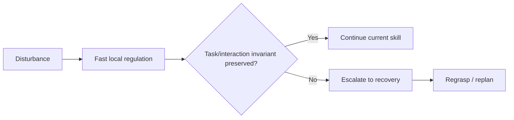

# AETHER-CL M8 — 02 Research Review and 02W Routing Decision

Date: 2026-10-09 (Asia/Shanghai)

Status: **02 accepts M8 Physics-Propagated Placement Disturbance within its frozen
scope. Prototype A has now covered held transport, released placement, contact-rich
insertion, and one physics-propagated disturbance family. The remaining planned
closure dimension is non-privileged verification.**

Authority: audited M8 evidence published at `4a6396a8ef8fc33fb543f37638f0ba7a81a784ea`, including
`AETHER_CL_M8_Results.md`, the independent machine audit and the M8
return-to-02 handoff.

## 1. M8 acceptance

02 accepts the audited M8 result:

- 360 retained episodes on fresh seeds 160–179;
- 288,000 replayed actions with zero maximum replay error;
- 1,440,000 external physics samples and 1,500 engine-force calls;
- all 340 exact matched comparisons pass;
- Baseline/V1 succeed in 70/120 condition episodes;
- V2 succeeds in 115/120;
- V2 attempts all 50 matched Baseline failures and rescues 45;
- all 70 Baseline-success pairs remain successful with no recovery;
- five failed retries remain retained and auditable.

The supported claim is:

> **In this privileged-state single-arm released-placement task, the accepted
> verification-gated one-episode recovery remains useful when the disturbance
> is transmitted through the simulator rigid-body force API rather than direct
> pose or waypoint manipulation.**

This is simulation evidence. It does not establish real-robot force robustness,
non-privileged perception, learning, or universal recovery.

## 2. Hypothesis updates

### H4 — recovery as intelligence

Status: **stronger bounded support under physical disturbance.**

M8 demonstrates that the recovery pattern remains useful when the state
deviation is produced by contact/rigid-body dynamics rather than a direct
kinematic relocation.

The five retained failures expose another important limitation: a bounded local
recovery strategy has a **corrective envelope** or **recovery basin**. When the
disturbance leaves the object far enough from the recovery's expected approach
state, the current approach/descend stages can expire before reacquisition.

Working formulation:

> Effective recovery requires appropriate invocation, task-effect-aligned phase
> semantics, an applicable corrective strategy, and a disturbed state that lies
> within the strategy's effective corrective envelope. Outside that envelope,
> the system should eventually escalate rather than indefinitely retry the same
> local recovery.

This connects directly to the earlier hierarchical-recovery hypothesis.

### H3 — verification as selective intervention

Status: **supported under the M8 force-disturbance family.**

V2 attempts exactly the 50 matched failed placements and leaves all 70
Baseline-success outcomes untouched. Privileged verification therefore continues
to provide useful selective invocation under a physically propagated disturbance.

### H7 — adaptive capability allocation

M8 further supports the distinction between **having** recovery and deciding
**when** to invoke it. It does not yet test more expensive reasoning, prediction
or memory allocation.

## 3. Disturbance regulation versus recovery

M8 disturbs the cube **after release**. It therefore evaluates recovery after a
task-relevant state has been disrupted.

It does **not** test continuous interaction regulation while the robot is still
holding or manipulating an object.

A separate future research question is now recorded:

> **Disturbance accommodation before recovery:** can a fast control/skill loop
> preserve the current manipulation invariant under perturbation (for example by
> adjusting hand pose, contact force or local motion), and when should the system
> declare that local regulation has failed and escalate to regrasp/recovery?

Conceptually:



This is consistent with AETHER's multi-timescale feedback view, but it is **not**
added to Prototype A closure and no force-regulation experiment is authorized by
this review.

## 4. Prototype A closure status

Accepted task/evaluation dimensions now include:

- held target-reaching recovery;
- verification-gating attribution;
- released support placement and effect-aligned recovery;
- contact-rich insertion recovery;
- physics-propagated released-placement disturbance recovery.

The remaining planned Prototype A closure dimension is:

- **non-privileged sensor-based verification**.

02 does not authorize M9 directly. Verifier architecture is consequential enough
to require a Work-mode deep-design investigation first.

## 5. Activate 02W

The next route is:

```text
02 accepts M8
  -> 02W deep investigation
  -> return to 02 for architecture decision
  -> M9 implementation in 06-01 only if authorized
```

Create/use:

> **02W — Non-Privileged Verification Architecture & M9 Design**

02W should not duplicate this persistent 02 notebook. Its job is to produce a
decision-quality comparison and experimental design.

### Required 02W questions

1. What information must a non-privileged verifier infer from RGB, RGB-D,
   proprioception and/or other realistic sensors to replace the current
   privileged geometry interface?
2. Which architecture is most appropriate for M9:
   - structured RGB/RGB-D state estimation + deterministic verification;
   - learned success/failure or state-transition detector;
   - multimodal/VLM verifier;
   - hybrid structured + learned verifier?
3. How should uncertainty/confidence, stale state, temporal persistence and
   intervention thresholds be represented?
4. What latency is acceptable for selective recovery invocation?
5. Which accepted task should M9 use to isolate sensing realism from task
   novelty? The current default candidate is the M8 released-placement force
   disturbance task, but 02W should challenge this.
6. What metrics distinguish perception error, verification error and recovery
   error?
7. How should the simulator camera/RGB-D pipeline be configured so that the
   measurement remains auditable and transferable toward future physical
   hardware?
8. What existing systems and literature provide the strongest comparator,
   including the newly public Aether AI CRIS-0 system and its causal
   state/prediction/verification loop?

### Required 02W output

Return to 02 with:

- architecture alternatives and tradeoffs;
- recommended M9 verifier architecture;
- exact observation/sensor interface;
- confidence/temporal-confirmation design;
- proposed matched experimental matrix;
- failure attribution and evaluation metrics;
- compute/latency considerations;
- confounds and stop conditions;
- recommendation on whether M9 is ready for 06-01.

02W must not implement M9 or mutate the frozen 06-01 scientific runtime.

## 6. Live-view and recording requirement

Future native rounds now have an explicit observability/communication
requirement recorded separately in
`docs/research/experiments/AETHER_Live_View_Requirements.md`.

Before the next native round:

- actual simulator camera output must be viewable through a local browser address
  (via SSH tunnel when executed on the server);
- a metrics dashboard or reconstructed cube/TCP geometry is insufficient;
- MP4 footage of the actual robot/object interaction must be saved;
- matched Baseline/V2 examples should use synchronized camera/framing/rate;
- rendering/capture must not silently change frozen controller, physics,
  disturbance, audit guards or reset history;
- replay/reconstructed footage must be clearly labeled and never substituted for
  original native camera footage.

This requirement changes observability and communication, not the scientific
scope by itself.

## 7. External Aether AI / CRIS-0 overlap

Aether AI publicly introduced CRIS-0 on 2026-10-08. Its public description
includes explicit task-relevant causal state, a causal world model, action/tool
selection, outcome verification, retry/replanning and long-horizon task
management.

This is close enough to AURA's independently developed AETHER research direction
that it must be treated as a serious comparator in 02W and future landscape
work. The overlap does **not** invalidate AURA's experiments or imply identical
architectures, but it raises two project-level concerns:

1. AURA must differentiate scientifically through controlled evidence,
   task/skill interface design, recovery characterization, experience and
   embodiment research rather than relying on broad closed-loop language.
2. The name **AETHER** now creates a substantial public-facing collision with
   **Aether AI** in the same Physical AI/robotics area.

This review does not rename historical AETHER artifacts. 02 recommends that
00/HQ perform a separate naming decision before further public-facing use of
"AETHER" as a framework brand. Until that decision, external materials should
prefer descriptive wording such as **AURA-Embodied adaptive physical
intelligence framework** or **AURA closed-loop manipulation prototype**, while
historical experiment identifiers remain unchanged for provenance.

## 8. Return boundary

Do **not** return to 06-01 yet.

Move next to **02W** for non-privileged verification/M9 design. After 02W
returns its synthesis, come back to this normal 02 chat for the architecture and
scope decision. Only then may 06-01 receive an M9 handoff.

PR #1 remains draft/unmerged unless separately accepted.
